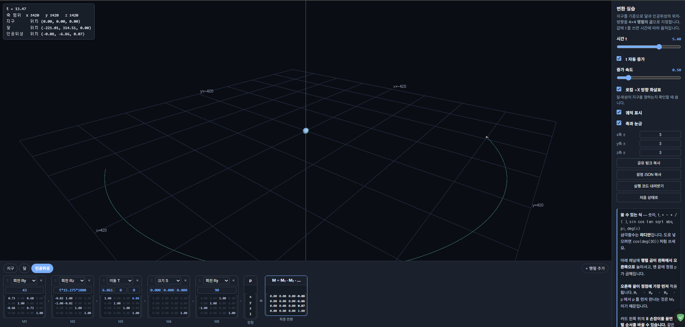
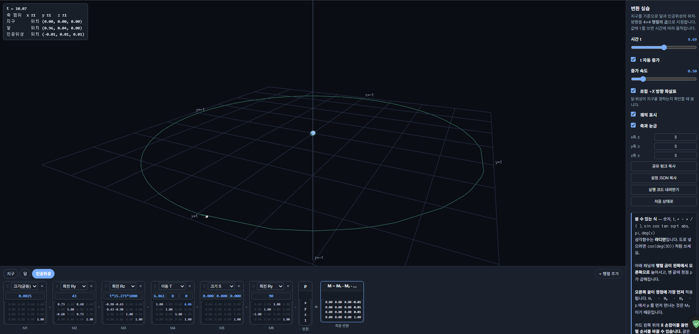
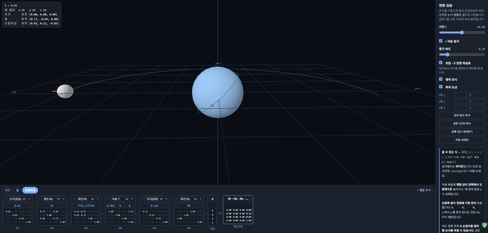

# 2주차 보고서

- 이름: 강진영
- 저장소: https://github.com/tqwuis/cg-solar
- 실행: [Task 1](task1.html) · [Task 2](task2.html) · [Task 3](task3.html)

## 조사한 값(위성 - 스타링크 32781)
| 항목 | 값 | 출처 |
| --- | --- | --- |
| 지구 반지름 | 6371 km | 위키백과 |
| 달 반지름 | 1737 km | 위키백과 |
| 달까지 거리 | 384400 km | 위키백과 |
| 달 일당 공전 | 0.036번 | 위키 백과 |
| 위성 궤도 반지름 | 6861 km | satellitemap.space |
| 위성 궤도 경사각 | 약 43° | satellitemap.space |
| 위성 일당 공전 | 15.275번 | satellitemap.space |
| 위성 크기 | 116 m | satellitemap.space |


## task1
[task1 공유 링크](https://cg.catholic.ac.kr/~mgchoi/CG/demos/d02-transform-lab.html?d=eyJyYW5nZSI6eyJ4IjoiNDIwIiwieSI6IjQyMCIsInoiOiI0MjAifSwib2JqZWN0cyI6W3siaWQiOiJlYXJ0aCIsIm5hbWUiOiLsp4DqtawiLCJjb2xvciI6WzAuMzUsMC42LDAuOTVdLCJzdGVwcyI6W3sidHlwZSI6IlMiLCJhcmdzIjpbIjYuMzcxIiwiNi4zNzEiLCI2LjM3MSJdfV19LHsiaWQiOiJtb29uIiwibmFtZSI6IuuLrCIsImNvbG9yIjpbMC43OCwwLjc4LDAuODJdLCJzdGVwcyI6W3sidHlwZSI6IlJ6IiwiYXJncyI6WyJ0KjAuMDM2KjEwMDAiXX0seyJ0eXBlIjoiVCIsImFyZ3MiOlsiMzg0LjQiLCIwIiwiMCJdfSx7InR5cGUiOiJTIiwiYXJncyI6WyIxLjczNyIsIjEuNzM3IiwiMS43MzciXX1dfSx7ImlkIjoic2F0IiwibmFtZSI6IuyduOqzteychOyEsSIsImNvbG9yIjpbMC45NSwwLjcyLDAuMzVdLCJzdGVwcyI6W3sidHlwZSI6IlJ5IiwiYXJncyI6WyI0MyJdfSx7InR5cGUiOiJSeiIsImFyZ3MiOlsidCoxNS4yNzUqMTAwMCJdfSx7InR5cGUiOiJUIiwiYXJncyI6WyI2Ljg2MSIsIjAiLCIwIl19LHsidHlwZSI6IlMiLCJhcmdzIjpbIjAuMDAwMTE2IiwiMC4wMDAxMTYiLCIwLjAwMDExNiJdfSx7InR5cGUiOiJSeSIsImFyZ3MiOlsiOTAiXX1dfV19)



### 거리의 단위를 무엇으로 정했는가? 왜 그렇게 정했는가?
**1000km**을 1로 둠, 지구 반지름이 6000km이기 때문이다.


### 숫자가 커서 생긴 문제가 있었는가? 있었다면 무엇인가?
지구의 반지름 대비 인공위성 크기가 너무 작아 보이지 않는다.

달까지 거리가 너무 멀어 잘 보이지 않는다.

달의 공전 주기에 비해 위성의 공전 주기가 너무 짧아 속도가 너무 빠르다.


### 달·위성이 지구를 향하게 만든 것은 어느 변환 단계 덕분인가?
달은 따로 회전 하지 않아도 이미 지구를 향함, 위성은 Ry를 해서 먼저 지구를 향하게 함

### 변환 입력값
``` json
{
  "range": {
    "x": "420",
    "y": "420",
    "z": "420"
  },
  "objects": [
    {
      "id": "earth",
      "name": "지구",
      "color": [
        0.35,
        0.6,
        0.95
      ],
      "steps": [
        {
          "type": "S",
          "args": [
            "6.371",
            "6.371",
            "6.371"
          ]
        }
      ]
    },
    {
      "id": "moon",
      "name": "달",
      "color": [
        0.78,
        0.78,
        0.82
      ],
      "steps": [
        {
          "type": "Rz",
          "args": [
            "t*0.036*1000"
          ]
        },
        {
          "type": "T",
          "args": [
            "384.4",
            "0",
            "0"
          ]
        },
        {
          "type": "S",
          "args": [
            "1.737",
            "1.737",
            "1.737"
          ]
        }
      ]
    },
    {
      "id": "sat",
      "name": "인공위성",
      "color": [
        0.95,
        0.72,
        0.35
      ],
      "steps": [
        {
          "type": "Ry",
          "args": [
            "43"
          ]
        },
        {
          "type": "Rz",
          "args": [
            "t*15.275*1000"
          ]
        },
        {
          "type": "T",
          "args": [
            "6.861",
            "0",
            "0"
          ]
        },
        {
          "type": "S",
          "args": [
            "0.000116",
            "0.000116",
            "0.000116"
          ]
        },
        {
          "type": "Ry",
          "args": [
            "90"
          ]
        }
      ]
    }
  ]
}
```
공통적으로 `Rz` `T` `S` 순서로 배치되어 있다. 지구를 바라본 방향이 유지되면서 공전하기 위해서이다.

`Rz`는 주기를 표현하기 위해 **t\*일당 공전\*1000** 으로 했는데 t에 비해 달의 공전이 너무 느리기 때문에 보완하기 위해 1000을 곱해주었다.

인공위성의 경우에는 공전 궤도 경사각을 위해 `Ry 43`을 맨 앞에 넣고, 태양 전지판의 방향이 지구를 바라보게 하기 위해 `Ry 90`을 맨 뒤에 넣었다.

## task2
[task2 공유 링크](https://cg.catholic.ac.kr/~mgchoi/CG/demos/d02-transform-lab.html?d=eyJyYW5nZSI6eyJ4IjoiMSIsInkiOiIxIiwieiI6IjEifSwib2JqZWN0cyI6W3siaWQiOiJlYXJ0aCIsIm5hbWUiOiLsp4DqtawiLCJjb2xvciI6WzAuMzUsMC42LDAuOTVdLCJzdGVwcyI6W3sidHlwZSI6IlN1IiwiYXJncyI6WyIwLjAwMjUiXX0seyJ0eXBlIjoiUyIsImFyZ3MiOlsiNi4zNzEiLCI2LjM3MSIsIjYuMzcxIl19XX0seyJpZCI6Im1vb24iLCJuYW1lIjoi64usIiwiY29sb3IiOlswLjc4LDAuNzgsMC44Ml0sInN0ZXBzIjpbeyJ0eXBlIjoiU3UiLCJhcmdzIjpbIjAuMDAyNSJdfSx7InR5cGUiOiJSeiIsImFyZ3MiOlsidCowLjAzNioxMDAwIl19LHsidHlwZSI6IlQiLCJhcmdzIjpbIjM4NC40IiwiMCIsIjAiXX0seyJ0eXBlIjoiUyIsImFyZ3MiOlsiMS43MzciLCIxLjczNyIsIjEuNzM3Il19XX0seyJpZCI6InNhdCIsIm5hbWUiOiLsnbjqs7XsnITshLEiLCJjb2xvciI6WzAuOTUsMC43MiwwLjM1XSwic3RlcHMiOlt7InR5cGUiOiJTdSIsImFyZ3MiOlsiMC4wMDI1Il19LHsidHlwZSI6IlJ5IiwiYXJncyI6WyI0MyJdfSx7InR5cGUiOiJSeiIsImFyZ3MiOlsidCoxNS4yNzUqMTAwMCJdfSx7InR5cGUiOiJUIiwiYXJncyI6WyI2Ljg2MSIsIjAiLCIwIl19LHsidHlwZSI6IlMiLCJhcmdzIjpbIjAuMDAwMTE2IiwiMC4wMDAxMTYiLCIwLjAwMDExNiJdfSx7InR5cGUiOiJSeSIsImFyZ3MiOlsiOTAiXX1dfV19)




### s를 얼마로 정했고 그 값을 어떻게 계산했는가?
*s*를 **0.0025**로 했다. 1/420(축 범위)을 계산한 후 근처 값으로 정함.

### 배율 행렬을 사슬의 맨 앞에 넣은 이유는 무엇인가? 맨 뒤에 넣으면 어떻게 되는가?
맨 앞의 배율은 마지막에 적용되므로, 이미 제자리에 놓인 물체를 위치까지 함께 줄이기 위해서다.

맨 뒤에 넣는다면 크기만 변하고 위치는 변하지 않는다.

### 세 물체에 같은 배율을 쓴 이유는 무엇인가?
task1에서의 실제 비율을 유지하기 위해서다.

### 비율을 유지한 결과, 화면에서 지구와 인공위성은 어떻게 보이는가?
지구에 비해 인공위성이 너무 작아 보이지 않는다.

### 변환 입력값
``` json
{
  "range": {
    "x": "1",
    "y": "1",
    "z": "1"
  },
  "objects": [
    {
      "id": "earth",
      "name": "지구",
      "color": [
        0.35,
        0.6,
        0.95
      ],
      "steps": [
        {
          "type": "Su",
          "args": [
            "0.0025"
          ]
        },
        {
          "type": "S",
          "args": [
            "6.371",
            "6.371",
            "6.371"
          ]
        }
      ]
    },
    {
      "id": "moon",
      "name": "달",
      "color": [
        0.78,
        0.78,
        0.82
      ],
      "steps": [
        {
          "type": "Su",
          "args": [
            "0.0025"
          ]
        },
        {
          "type": "Rz",
          "args": [
            "t*0.036*1000"
          ]
        },
        {
          "type": "T",
          "args": [
            "384.4",
            "0",
            "0"
          ]
        },
        {
          "type": "S",
          "args": [
            "1.737",
            "1.737",
            "1.737"
          ]
        }
      ]
    },
    {
      "id": "sat",
      "name": "인공위성",
      "color": [
        0.95,
        0.72,
        0.35
      ],
      "steps": [
        {
          "type": "Su",
          "args": [
            "0.0025"
          ]
        },
        {
          "type": "Ry",
          "args": [
            "43"
          ]
        },
        {
          "type": "Rz",
          "args": [
            "t*15.275*1000"
          ]
        },
        {
          "type": "T",
          "args": [
            "6.861",
            "0",
            "0"
          ]
        },
        {
          "type": "S",
          "args": [
            "0.000116",
            "0.000116",
            "0.000116"
          ]
        },
        {
          "type": "Ry",
          "args": [
            "90"
          ]
        }
      ]
    }
  ]
}
```
task1 에서 장면 전체를 줄이기 위해 세 물체의 행렬 맨 앞에 `Su`를 넣었다.

## task3
[task3 공유 링크](https://cg.catholic.ac.kr/~mgchoi/CG/demos/d02-transform-lab.html?d=eyJyYW5nZSI6eyJ4IjoiMSIsInkiOiIxIiwieiI6IjEifSwib2JqZWN0cyI6W3siaWQiOiJlYXJ0aCIsIm5hbWUiOiLsp4DqtawiLCJjb2xvciI6WzAuMzUsMC42LDAuOTVdLCJzdGVwcyI6W3sidHlwZSI6IlN1IiwiYXJncyI6WyIwLjAyIl19LHsidHlwZSI6IlMiLCJhcmdzIjpbIjYuMzcxIiwiNi4zNzEiLCI2LjM3MSJdfV19LHsiaWQiOiJtb29uIiwibmFtZSI6IuuLrCIsImNvbG9yIjpbMC43OCwwLjc4LDAuODJdLCJzdGVwcyI6W3sidHlwZSI6IlN1IiwiYXJncyI6WyIwLjAyIl19LHsidHlwZSI6IlJ6IiwiYXJncyI6WyJ0KjAuMDM2KjEwMDAiXX0seyJ0eXBlIjoiVCIsImFyZ3MiOlsiMzguNDQiLCIwIiwiMCJdfSx7InR5cGUiOiJTIiwiYXJncyI6WyIxLjczNyIsIjEuNzM3IiwiMS43MzciXX1dfSx7ImlkIjoic2F0IiwibmFtZSI6IuyduOqzteychOyEsSIsImNvbG9yIjpbMC45NSwwLjcyLDAuMzVdLCJzdGVwcyI6W3sidHlwZSI6IlN1IiwiYXJncyI6WyIwLjAyIl19LHsidHlwZSI6IlJ5IiwiYXJncyI6WyI0MyJdfSx7InR5cGUiOiJSeiIsImFyZ3MiOlsidCoxNS4yNzUqMTAiXX0seyJ0eXBlIjoiVCIsImFyZ3MiOlsiNi44NjEiLCIwIiwiMCJdfSx7InR5cGUiOiJTdSIsImFyZ3MiOlsiMC4xMTYiXX0seyJ0eXBlIjoiUnkiLCJhcmdzIjpbIjkwIl19XX1dfQ%3D%3D)




### 더 나은 표현 방법을 하나 이상 제안하고 실제로 만들어 보세요. (예: 크기만 과장하기, 거리를 로그로 압축하기, 축척 막대를 함께 보여 주기 등)
달의 거리만 **1/10**로 줄였다. 인공 위성의 크기만 **1000배** 확대했다. 인공 위성의 공전 주기를 **1/100**로 줄였다.

### 제안한 방법의 장점과 잃는 것을 함께 쓰세요.
장점: 사용자가 모든 물체를 명확히 인식이 가능하다. 잃는 것: 달과 지구의 거리가 가까워 보임, 인공위성이 실제보다 크게 보임, 공전 주기를 명확히 전달하기 힘듦. 

### 변환 입력값
``` json
{
  "range": {
    "x": "1",
    "y": "1",
    "z": "1"
  },
  "objects": [
    {
      "id": "earth",
      "name": "지구",
      "color": [
        0.35,
        0.6,
        0.95
      ],
      "steps": [
        {
          "type": "Su",
          "args": [
            "0.02"
          ]
        },
        {
          "type": "S",
          "args": [
            "6.371",
            "6.371",
            "6.371"
          ]
        }
      ]
    },
    {
      "id": "moon",
      "name": "달",
      "color": [
        0.78,
        0.78,
        0.82
      ],
      "steps": [
        {
          "type": "Su",
          "args": [
            "0.02"
          ]
        },
        {
          "type": "Rz",
          "args": [
            "t*0.036*1000"
          ]
        },
        {
          "type": "T",
          "args": [
            "38.44",
            "0",
            "0"
          ]
        },
        {
          "type": "S",
          "args": [
            "1.737",
            "1.737",
            "1.737"
          ]
        }
      ]
    },
    {
      "id": "sat",
      "name": "인공위성",
      "color": [
        0.95,
        0.72,
        0.35
      ],
      "steps": [
        {
          "type": "Su",
          "args": [
            "0.02"
          ]
        },
        {
          "type": "Ry",
          "args": [
            "43"
          ]
        },
        {
          "type": "Rz",
          "args": [
            "t*15.275*10"
          ]
        },
        {
          "type": "T",
          "args": [
            "6.861",
            "0",
            "0"
          ]
        },
        {
          "type": "Su",
          "args": [
            "0.116"
          ]
        },
        {
          "type": "Ry",
          "args": [
            "90"
          ]
        }
      ]
    }
  ]
}
```

더 잘 보이게 하기 위해 task2에서 넣었던 `Su`의 수치를 높였다. 달의 거리인 `T`, 위성의 크기인 `S` 주기를 표현하는 `Rz`의 수치를 상기했던 대안에 맞게 조정하였다.