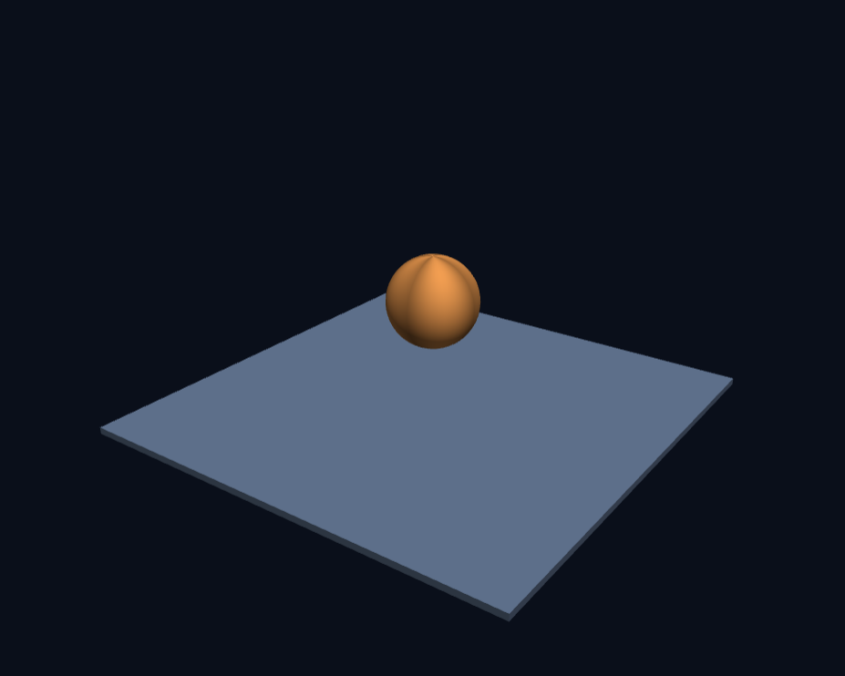
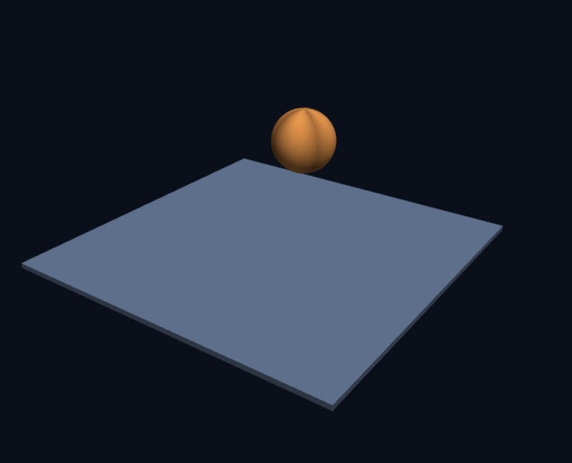
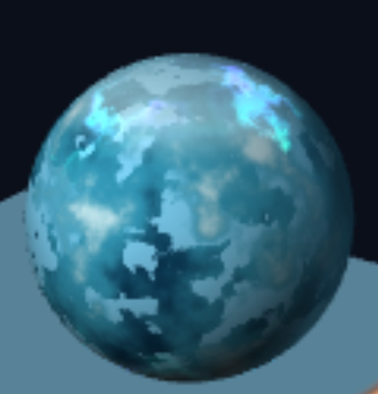
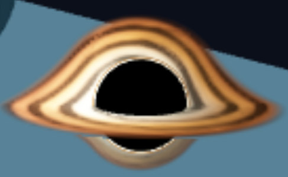

# 3주차 보고서

- 저장소: https://github.com/tqwuis/cg-solar
- 실행: [Task 1](https://tqwuis.github.io/cg-solar/week3/task1.html) · [Task 2](https://tqwuis.github.io/cg-solar/week3/task2.html)


## Task 1
### 회전과 이동의 순서 비교



회전 후 이동은 제자리에서 회전했다

이동 후 회전은 축을 기준으로 공전했다

### 법선을 색으로 바꿔본 셰이더


프래그먼트 셰이더 코드
```
void main() {
  // 법선은 -1~1 이므로 0~1 로 옮겨서 색으로 봅니다
  vec3 N = normalize(vNormal);
  fragColor = vec4(N * 0.5 + 0.5, 1.0);
}
```

## Task 2
### 행성 1



#### 의도 — 무엇을 만들고 싶었는가

빙하가 떠다니면서 오로라가 수시로 나타나는 얼음 행성
<br>자연 현상에서 아름답다고 생각되는 것들 중 하나가 오로라이다. 이것을 행성 경관에 보여주어 아름다운 경관을 느끼길 바랐다.
<br>예시에서 지형을 좀 다양하게 추가하고, 수시로 변하고 나타났다 사라지는 오로라 띠를 보여주었다.

#### 방법 — 어떻게 만들었는가

지형을 구현하기 위한 높이 잡음 계산, 오로라를 구현하기 위해 위도, 경도, 시간에 따라 변하는 잡음 계산, 오로라 색을 구현하기 위해 `mix`와 `smoothstep`을 이용한 계산


얼음 무늬는 `height = fbm(S * 3.0)`으로 불규칙한 값을 만들고, `mix`로 푸른 얼음색과 흰 눈색을 섞어 표현했다.
<br>오로라는 `1.0 - smoothstep(0.012, 0.152, ringDistance)`로 중심선에 가까운 곳만 밝게 만들어 띠 모양을 냈다.
<br>여기에 시간에 따라 변하는 `appearance`를 곱해 오로라가 서서히 나타났다 사라지게 했다.

프래그먼트 셰이더 코드
```
#version 300 es
precision highp float;

in vec3 vColor;
in vec3 vNormal;      // 세계 기준 법선 — 빛 계산에 쓴다
in vec3 vSurf;        // 물체 기준 법선 — 무늬가 표면에 붙어 돌게 한다

uniform float uTime;

out vec4 fragColor;

/* ── 잡음 만들기 ───────────────────────────────────────────────
   이미지 파일 없이 무늬를 만들려면 "규칙적이지 않아 보이는 숫자"가 필요합니다.
   아래는 좌표를 넣으면 언제나 같은 0~1 값을 돌려주는 가짜 난수입니다.        */
float hash31(vec3 p) {
  p = fract(p * 0.3183099 + vec3(0.71, 0.113, 0.419));
  p *= 17.0;
  return fract(p.x * p.y * p.z * (p.x + p.y + p.z));
}

// 격자 꼭짓점의 난수를 부드럽게 섞어 "덩어리진" 잡음을 만듭니다
float noise3(vec3 x) {
  vec3 i = floor(x), f = fract(x);
  f = f * f * (3.0 - 2.0 * f);                 // 부드럽게 (smoothstep 과 같은 곡선)
  return mix(mix(mix(hash31(i + vec3(0,0,0)), hash31(i + vec3(1,0,0)), f.x),
                 mix(hash31(i + vec3(0,1,0)), hash31(i + vec3(1,1,0)), f.x), f.y),
             mix(mix(hash31(i + vec3(0,0,1)), hash31(i + vec3(1,0,1)), f.x),
                 mix(hash31(i + vec3(0,1,1)), hash31(i + vec3(1,1,1)), f.x), f.y), f.z);
}

// 크기가 다른 잡음을 여러 겹 더합니다 → 큰 덩어리와 잔 무늬가 함께 생깁니다
float fbm(vec3 p) {
  float v = 0.0, a = 0.5;
  for (int i = 0; i < 5; i++) { v += a * noise3(p); p *= 2.02; a *= 0.5; }
  return v;
}

void main() {
  // N은 조명 계산에 사용하고, S는 행성 표면에 무늬를 붙이는 좌표처럼 사용합니다.
  vec3 N = normalize(vNormal);
  vec3 S = normalize(vSurf);

  // L은 빛이 오는 방향입니다. x, y, z 값을 바꾸면 빛의 방향이 바뀝니다.
  vec3 L = normalize(vec3(0.0, 0.4, 0.65));

  // 법선 N과 빛 방향 L이 같은 방향을 볼수록 밝아집니다.
  // 두 방향이 반대라면 음수가 되므로 max(..., 0.0)으로 어둡게 제한합니다.
  float diff = max(dot(N, L), 0.0);

  // 표면이 카메라를 정면으로 향하지 않을수록 가장자리에 가까운 부분입니다.
  // 이 값을 이용해 행성 가장자리에 푸른 림 라이트를 만듭니다.
  float rim = pow(1.0 - max(dot(N, normalize(vec3(0.0, 0.0, 1.0))), 0.0), 3.0);

  // 큰 크기의 잡음입니다. 얼음 표면의 큰 색 덩어리를 만드는 데 사용합니다.
  float height = fbm(S * 3.0);

  // 더 촘촘한 잡음입니다. 시간값을 조금 섞어 얼음의 세부 무늬가 천천히 움직이게 합니다.
  float detail = fbm(S * 5.0 + vec3(0.0, uTime * 0.015, 0.0));

  // detail과 height를 조합해 얼음 표면의 균열처럼 보이는 영역을 만듭니다.
  // smoothstep은 두 숫자 사이를 부드럽게 0에서 1로 바꾸는 함수입니다.
  float crack = smoothstep(0.48, 0.54, detail) * smoothstep(0.68, 0.52, height);

  // 얼음에 사용할 세 가지 기본 색입니다.
  // deepIce는 깊은 얼음, blueIce는 푸른 얼음, snowIce는 밝은 눈 부분입니다.
  vec3 deepIce = vec3(0.035, 0.22, 0.34);
  vec3 blueIce = vec3(0.20, 0.60, 0.72);
  vec3 snowIce = vec3(0.82, 0.94, 0.96);

  // height 값에 따라 깊은 얼음에서 푸른 얼음으로 색을 섞습니다.
  vec3 albedo = mix(deepIce, blueIce, smoothstep(0.20, 0.58, height));

  // height가 큰 곳은 눈이 쌓인 것처럼 밝은 색을 추가합니다.
  albedo = mix(albedo, snowIce, smoothstep(0.58, 0.82, height));

  // 균열 영역에는 조금 더 밝은 청록색을 섞어 얼음의 갈라진 결을 강조합니다.
  albedo = mix(albedo, vec3(0.52, 0.85, 0.99), crack * 0.92);

  // S.y는 위아래 위치를 나타냅니다. 절댓값을 사용하면 북극과 남극을 함께 선택합니다.
  float latitude = abs(S.y);

  // 위도가 높을수록 극지방입니다. 극지방을 하얀 얼음으로 덮습니다.
  float polarCap = smoothstep(0.67, 0.90, latitude + height * 0.12);
  albedo = mix(albedo, vec3(0.88, 0.98, 1.0), polarCap * 0.55);

  // 오로라의 위치를 조금씩 흔들기 위한 잡음입니다.
  // uTime을 더했기 때문에 시간이 지나면 잡음 무늬도 천천히 움직입니다.
  float ringNoise = fbm(S * 4.0 + vec3(0.0, uTime * 0.04, 0.0));

  // 현재 표면 위치의 경도 방향 각도입니다.
  // atan을 사용하면 행성 표면을 둘러 도는 위치를 알 수 있습니다.
  float angle = atan(S.z, S.x);

  // 하나의 오로라 중심선이 중간 위도와 고위도 사이를 천천히 왕복합니다.
  // mix(0.42, 0.86, t)는 t가 0이면 0.42, 1이면 0.86을 반환합니다.
  float latitudeShift = mix(0.42, 0.86, 0.5 + 0.5 * sin(uTime * 0.24));

  // 경도마다 선의 위치를 조금씩 다르게 해 완전한 원이 아닌 구불구불한 선을 만듭니다.
  // sin의 배수를 바꾸면 구불거림의 횟수와 모양이 달라집니다.
  float wavyOffset = 0.055 * sin(angle * 2.0 + uTime * 0.45)
                   + 0.025 * sin(angle * 5.0 - uTime * 0.70);

  // 현재 경도에서 오로라 선이 지나가는 중심 위도입니다.
  float ringCenter = latitudeShift + wavyOffset + (ringNoise - 0.5) * 0.935;

  // 현재 픽셀의 위도와 오로라 중심선의 거리를 계산합니다.
  float ringDistance = abs(latitude - ringCenter);

  // 중심선에 가까운 픽셀만 1에 가깝게 만듭니다. 이것이 얇은 오로라 띠입니다.
  float auroraRing = 1.0 - smoothstep(0.012, 0.152, ringDistance);

  // 오로라 띠 전체를 같은 밝기로 칠하지 않고, 밝은 부분이 경도를 따라 움직이게 합니다.
  float movingLine = sin(angle * 3.0 - uTime * 0.75 + ringNoise * 5.0);
  float auroraLine = smoothstep(0.54, 0.90, movingLine * 0.5 + 0.5);

  // 오로라의 전체 밝기를 시간에 따라 조절합니다.
  // 그래서 오로라가 서서히 나타났다가 사라지는 효과가 생깁니다.
  float cycle = sin(uTime * 0.38) * 0.5 + 0.5;
  float appearance = smoothstep(0.10, 0.38, cycle)
                   * (1.0 - smoothstep(0.64, 0.90, cycle));

  // 위치(auroraRing), 선명한 부분(auroraLine), 나타나는 정도(appearance)를 합칩니다.
  float aurora = auroraRing * (0.12 + 0.88 * auroraLine) * appearance;

  // 잡음값에 따라 청록색과 보라색 사이에서 오로라 색을 선택합니다.
  vec3 auroraColor = mix(vec3(0.01, 0.52, 0.36), vec3(0.30, 0.08, 0.72),
                         smoothstep(0.25, 0.80, ringNoise));

  // 먼저 얼음의 기본 색에 조명(diff)을 적용합니다.
  vec3 color = albedo * (0.1 + 0.9 * diff);

  // 오로라는 실제 물체 색에 빛을 더하는 발광 효과처럼 표현합니다.
  // rim을 곱해 행성 가장자리에서 오로라가 더 강하게 보이게 합니다.
  color += auroraColor * aurora;

  // 오로라와 별개로 행성 가장자리에 푸른빛을 살짝 추가합니다.
  color += vec3(0.22, 0.55, 0.72) * rim * 0.25;

  // RGB 색과 불투명도 1.0을 합쳐 최종 픽셀 색으로 출력합니다.
  fragColor = vec4(color, 1.0);
}
```

### 행성 2



#### 의도 — 무엇을 만들고 싶었는가

블랙홀
<br>우주에서 굉장히 특이한 유형인 블랙홀이다. 블랙홀의 특징을 보게 하고 싶었다.
<br>검게 칠해진 중심부, 회전하는 강착원반과 블랙홀의 강한 중력에 의해 위아래로 휘어진 모습

#### 방법 — 어떻게 만들었는가


구의 정점을 원반으로 펼치고 뒤쪽을 위로 휘게 만드는 위치 계산이 필요했다.
<br>가스가 흐르는 모습에는 시간에 따라 움직이는 나선무늬와 밝기·색 변화가 필요했다.
<br>검은 중심은 빛을 더하지 않고 검정색으로 출력했으며, 휘어진 모습은 정점 변형으로 근사했다.


원반은 `mix(0.68, 2.50, latitude)`로 반경을 정하고, `bend = smoothstep(0.0, 0.65, rear)`로 뒤쪽을 부드럽게 휘게 했다.
<br>가스는 `phase = angle - uTime * 0.70`과 `sin(spiral)`로 굵은 나선무늬가 회전하도록 만들었다.
<br>원반의 앞뒤에 같은 무늬 좌표를 사용해 위로 휘어진 부분에서도 가스 흐름이 끊기지 않게 했다.

블랙홀의 중심부를 검게 칠하는 것은 매우 쉽게 가능했다. 하지만 강착 원반이 중력에 의해 위아래로 휘어진 모습을 구현하는 것은 꽤 시간이 걸렸다. 

다음은 강착 원반을 구현하기 위해서 한 몇가지 시도들이다.
- 구 표면에 블랙홀 모습 덧씌우기 -> 남는 픽셀이 어색하게 보여 실패
- 원반과 검은 중심 사이에 틈이 생김 -> 원반 안쪽을 중심까지 겹치게 하고 접합부를 불투명하게 바꿨다.
- 무늬가 잘 안 보이고 두 원반의 연결이 끊김 -> 나선을 굵게 하고, 하나의 원반을 휘게 만들어 무늬도 함께 이어지게 했다.


버텍스 셰이더 코드
```
#version 300 es
precision highp float;

layout(location=0) in vec3 aPos;
layout(location=1) in vec3 aNormal;

uniform mat4 uModel;
uniform mat4 uViewProj;
uniform int uSphereColumns;

flat out int vPart;
out vec2 vOrbit;
out float vRadial;
out float vApproach;
out float vBend;

const float PI = 3.14159265359;

void main() {
  vPart = gl_InstanceID;
  float size = length(aPos);             // 원래 구의 반지름을 크기 기준으로 사용

  // 극점의 법선에는 경도가 없으므로 원래 구 격자의 정점 번호로 복원합니다.
  float longitude = float(gl_VertexID % (uSphereColumns + 1))
                  / float(uSphereColumns) * 2.0 * PI;
  // 아래쪽의 보조 렌즈상은 뒤쪽 반원의 가스가 한 번 더 보이는 모습입니다.
  if (vPart == 2) longitude *= 0.5;
  float latitude = acos(clamp(aNormal.y, -1.0, 1.0)) / PI;
  vec2 orbit = vec2(cos(longitude), sin(longitude));
  vOrbit = orbit;
  vRadial = latitude;
  vApproach = 0.0;
  vBend = 0.0;

  // 현재 투영 행렬에서 카메라의 오른쪽·위쪽 방향을 얻습니다.
  // 렌즈상과 광자 고리는 물체의 자전과 독립적으로 관찰자를 향합니다.
  vec3 right = normalize(vec3(uViewProj[0][0], uViewProj[1][0], uViewProj[2][0]));
  vec3 up = normalize(vec3(uViewProj[0][1], uViewProj[1][1], uViewProj[2][1]));
  vec3 towardEye = normalize(cross(right, up));
  vec3 center = uModel[3].xyz;
  vec3 world;

  if (vPart == 0) {
    // 그림자를 만드는 가림용 구. 물리적 사건의 지평선 크기와는 다릅니다.
    world = (uModel * vec4(aPos * 0.78, 1.0)).xyz;
  } else if (vPart == 1 || vPart == 2) {
    // 하나의 원반에서 앞쪽은 얇게, 뒤쪽은 위로 휘게 만듭니다.
    // 적도 원반과 위쪽 렌즈상이 같은 정점·삼각형·무늬 좌표로 이어집니다.
    float diskRadius = size * mix(0.68, 2.50, latitude);
    float lensRadius = size * mix(0.72, vPart == 1 ? 1.60 : 1.15, latitude);
    float rear = max(orbit.y, 0.0);
    // 빠르게 원형 렌즈상으로 이어 주되, 양 끝의 기울기는 0으로 유지합니다.
    float bend = smoothstep(0.0, 0.65, rear);
    vBend = bend;

    // 양쪽 접합부에서는 bend와 그 기울기가 모두 0입니다.
    // 따라서 위치뿐 아니라 곡면의 진행 방향도 끊김 없이 이어집니다.
    float x = orbit.x * mix(diskRadius, lensRadius, bend);
    float y = orbit.y * mix(diskRadius * 0.21, lensRadius, bend);
    float depth = mix(-diskRadius * orbit.y * 0.9777, -size * 0.10, bend);
    if (vPart == 2) y = -y;
    world = center + right * x + up * y + towardEye * depth;

    // 렌즈로 보이는 형태는 고정하고 원래 가스의 좌표만 자전시킵니다.
    // 앞·뒤 모두 같은 변환과 시간을 써서 나선무늬가 접합부를 지나 흐릅니다.
    vec3 sourceOrbit = transpose(mat3(uModel)) * vec3(orbit.x, 0.0, orbit.y);
    vOrbit = sourceOrbit.xz;
    vApproach = -orbit.x * 0.9777;
  } else {
    // 그림자 경계에 붙는 좁고 거의 원형인 광자 고리.
    float radius = size * mix(0.765, 0.845, latitude);
    float depth = size * 0.06;
    world = center + radius * (right * orbit.x + up * orbit.y) + towardEye * depth;
    vApproach = -orbit.x * 0.85;
  }

  gl_Position = uViewProj * vec4(world, 1.0);
}
```


프래그먼트 셰이더 코드
```
#version 300 es
precision highp float;

flat in int vPart;
in vec2 vOrbit;
in float vRadial;
in float vApproach;
in float vBend;

uniform float uTime;
out vec4 fragColor;

// 얼음 행성과 같은 연속 잡음으로, 흐르는 가스의 농도를 만듭니다.
float hash31(vec3 p) {
  p = fract(p * 0.3183099 + vec3(0.71, 0.113, 0.419));
  p *= 17.0;
  return fract(p.x * p.y * p.z * (p.x + p.y + p.z));
}

float noise3(vec3 p) {
  vec3 i = floor(p), f = fract(p);
  f = f * f * (3.0 - 2.0 * f);
  return mix(mix(mix(hash31(i), hash31(i + vec3(1,0,0)), f.x),
                 mix(hash31(i + vec3(0,1,0)), hash31(i + vec3(1,1,0)), f.x), f.y),
             mix(mix(hash31(i + vec3(0,0,1)), hash31(i + vec3(1,0,1)), f.x),
                 mix(hash31(i + vec3(0,1,1)), hash31(i + vec3(1,1,1)), f.x), f.y), f.z);
}

float fbm(vec3 p) {
  float value = 0.0, amplitude = 0.5;
  for (int i = 0; i < 4; i++) {
    value += amplitude * noise3(p);
    p = p * 2.03 + vec3(5.2, 1.3, 2.8);
    amplitude *= 0.5;
  }
  return value;
}

void main() {
  if (vPart == 0) {
    fragColor = vec4(0.0, 0.0, 0.0, 1.0);
    return;
  }

  float r = clamp(vRadial, 0.0, 1.0);
  vec2 orbit = normalize(vOrbit);
  float angle = atan(orbit.y, orbit.x);

  // 큰 가스 덩어리를 회전시키고, 제한된 뒤틀림으로 시간이 지나도 무늬 크기를 유지합니다.
  float phase = angle - uTime * 0.70;
  float shear = 0.45 * sin(r * 5.0 - uTime * 0.35);
  vec3 flow = vec3(cos(phase + shear) * 1.8, sin(phase + shear) * 1.8, r * 3.5);
  float turbulence = fbm(flow);

  // 약 20겹이던 미세한 줄을 3~4겹의 굵은 나선으로 바꿉니다.
  // 경도에 직접 연결된 세 갈래 나선이므로 회전하는 흐름도 눈에 잘 보입니다.
  float spiral = r * 22.0 - phase * 3.0 + shear + turbulence * 2.0;
  // atan의 -π/π 경계에서도 줄무늬가 끊기지 않도록 각도 대신 방향벡터를 미분합니다.
  vec2 tangent = vec2(-orbit.y, orbit.x);
  vec2 angleGradient = vec2(dot(tangent, dFdx(orbit)), dot(tangent, dFdy(orbit)));
  float radialPhase = r * 22.0 + shear + turbulence * 2.0;
  vec2 spiralGradient = vec2(dFdx(radialPhase), dFdy(radialPhase)) - 3.0 * angleGradient;
  float footprint = abs(spiralGradient.x) + abs(spiralGradient.y);
  float bands = 0.5 + 0.5 * sin(spiral) * exp(-0.5 * footprint * footprint);
  float streams = smoothstep(0.18, 0.82, bands);
  float clumps = smoothstep(0.25, 0.70, turbulence);
  float gas = mix(0.14, 1.55, streams) * mix(0.65, 1.30, clumps);

  // 뜨거운 안쪽은 황백색, 바깥쪽은 어두운 주황색입니다.
  vec3 hot = vec3(1.0, 0.86, 0.60);
  vec3 warm = vec3(1.0, 0.38, 0.075);
  vec3 cool = vec3(0.52, 0.085, 0.018);
  vec3 emission = mix(hot, warm, smoothstep(0.0, 0.50, r));
  emission = mix(emission, cool, smoothstep(0.35, 1.0, r));

  // 접근하는 쪽은 더 밝고 희게, 후퇴하는 쪽은 더 어둡고 붉게 만드는 도플러 근사.
  float beaming = pow(1.0 / (1.0 - 0.30 * vApproach), 3.0);
  emission = mix(emission, vec3(0.78, 0.88, 1.0),
                 max(vApproach, 0.0) * (1.0 - r) * 0.18);
  float intensity = gas * beaming * mix(1.85, 0.70, r);
  // 안쪽은 불투명하게 이어 붙이고 바깥쪽 가장자리만 흐리게 합니다.
  // 어두운 가스도 알파 대신 발광량을 줄여 표현하므로 배경이 비치지 않습니다.
  float alpha = 1.0 - smoothstep(0.78, 1.0, r);

  if (vPart == 2) {
    // 아래쪽의 보조 상만 희미하게 더하고, 양 끝에서는 사라지게 해 접합부의 중복을 피합니다.
    intensity *= 0.55;
    alpha *= 0.65 * smoothstep(0.0, 0.45, vBend);
  } else if (vPart == 3) {
    // 얇은 빛의 고리. 검은 중심에는 빛을 더하지 않습니다.
    float line = exp(-pow((r - 0.34) / 0.19, 2.0));
    emission = mix(vec3(1.0, 0.40, 0.10), hot, line);
    intensity = (0.65 + 2.6 * line) * beaming;
    alpha = sin(r * 3.14159265359) * 0.88;
  }

  if (alpha < 0.015) discard;
  vec3 color = vec3(1.0) - exp(-emission * intensity); // 과도한 흰색 포화를 줄이는 노출 변환
  color = pow(color, vec3(1.0 / 2.2));
  fragColor = vec4(color * alpha, alpha); // 미리 곱한 알파로 가장자리를 부드럽게 합성
}
```
