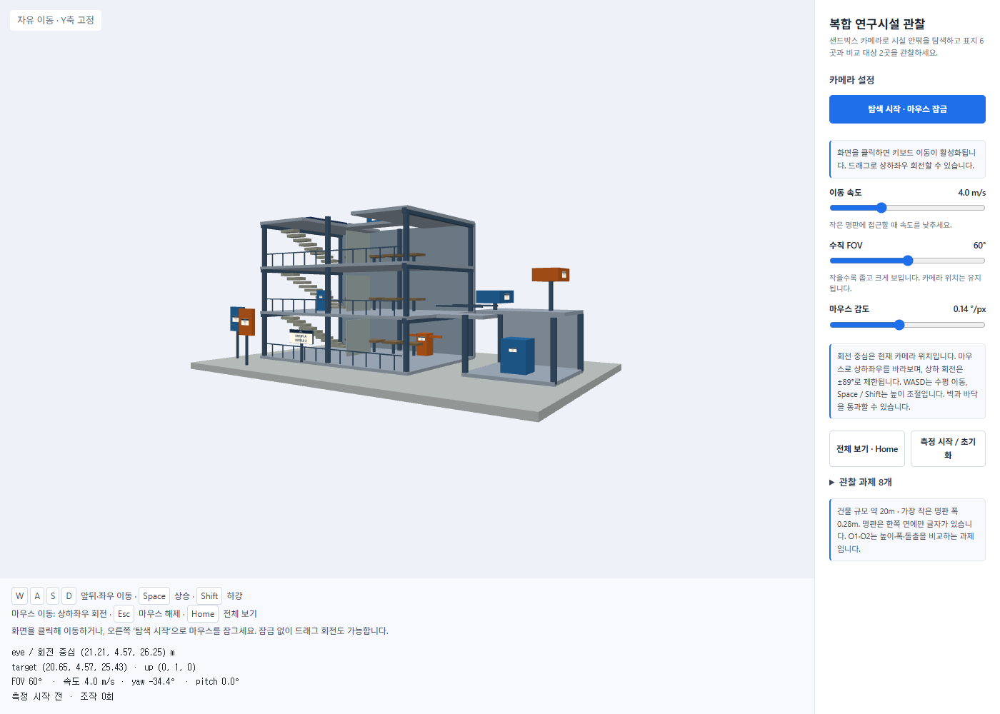

# 4주차 보고서

- 이름: 강진영
- 저장소: https://github.com/tqwuis/cg-solar
- GitHub Pages 실행: [기본 버전](https://tqwuis.github.io/cg-solar/week4/baseline/index.html) · [개선 버전](https://tqwuis.github.io/cg-solar/week4/improved/index.html)

제공된 시작 코드를 `week4/improved`에서 수정하여 샌드박스 방식의 카메라를 구현했다. `week4/baseline`은 비교용 원본으로 유지했고, 건물과 명판의 위치·크기·내용도 변경하지 않았다.


**작성 안내:** `________`는 직접 측정한 결과나 본인의 경험·판단을 적는 공란이다. 코드 및 재현 캡처로 확인한 내용과 사용자 실측 기록을 구분했다.

## 두 버전의 실행과 조작법

### 기본 버전


건물을 중심으로 카메라가 회전하는 트랙볼 방식이다. 회전과 화면 기준 평행 이동, 카메라와 중심 사이의 거리 조절을 조합해 관찰한다.

| 입력 | 동작 |
| --- | --- |
| 마우스 드래그 | 트랙볼 회전 |
| Shift + 드래그 / 오른쪽 버튼 드래그 | 화면 기준 평행 이동 |
| 마우스 휠 | 회전 중심과 카메라 사이의 거리 조절 |
| 방향키 | 회전 |
| + / − | 거리 축소 / 확대 |
| Home / 전체 보기 | 초기 카메라로 복귀 |
| 측정 시작 / 초기화 | 경과 시간과 조작 횟수 초기화 |

키보드 조작은 캔버스에 포커스가 있을 때 사용한다. 기본 FOV는 45°이며 휠은 FOV가 아니라 거리를 바꾼다.

### 개선 버전



카메라가 현재 위치에서 방향을 바꾸고, 키보드로 시설 안팎을 이동하는 방식이다. `탐색 시작` 버튼으로 마우스를 잠그거나, 화면을 클릭한 뒤 드래그하여 회전할 수 있다.

| 입력 | 동작 |
| --- | --- |
| W / S | 바라보는 수평 방향으로 전진 / 후진 |
| A / D | 왼쪽 / 오른쪽으로 수평 이동 |
| Space / Shift | 월드 Y축 기준 상승 / 하강 |
| 마우스 좌우 이동 | 좌우 회전, yaw 변경 |
| 마우스 상하 이동 | 위아래 회전, pitch 변경 |
| Esc | 마우스 잠금 해제 |
| Home / 전체 보기 | 전체 모델을 보는 위치로 복귀, FOV 60°·pitch 0° |
| 속도 / FOV / 감도 슬라이더 | 이동 속도, 수직 화각, 마우스 감도 조절 |
| 측정 시작 / 초기화 | 경과 시간과 조작 횟수 초기화 |

이동 속도는 기본 8 m/s이고 0.2~12 m/s로 조절한다. 위아래를 바라보아도 WASD는 수평 이동을 유지한다. 충돌과 중력은 구현하지 않았으므로 벽과 바닥을 통과할 수 있다.

## 기본 버전의 관찰 결과와 불편

### 지점별 관찰 결과

다음은 **관찰 위치를 지정한 재현 캡처와 모델 데이터로 확인한 결과**이다. 기본 조작만으로 해당 지점까지 찾아가는 사용자 실험 결과는 아니다. 직접 탐색한 성공 여부와 시간은 뒤의 실측 표에 기록한다.

| 지점 | 관찰 목표 | 확인한 결과 | 기본 방식에서 필요한 조작 |
| --- | --- | --- | --- |
| P1 본관 입구 | 동 이름과 층수 | `ENTRY A`, `LEVELS 3` | 전면으로 회전하고 안내판에 접근 |
| P2 1층 안쪽 밸브 | 식별 번호와 상태 | `V-07`, `OPEN` | 실내 표지가 보이는 방향으로 중심 이동 후 거리 조절 |
| P3 2층 제어함 | 회로 번호와 전압 | `B-12`, `24 V` | 2층 높이로 평행 이동하고 작은 명판 확대 |
| P4 옥상 서비스 장치 | 이름과 점검 주기 | `FILTER`, `30 DAYS` | 옥상이 보이도록 회전하고 표지 앞쪽으로 접근 |
| P5 본관 뒤쪽 배관 | 용도와 유량 | `RETURN`, `8 L/min` | 건물 뒤로 돌아가 명판의 글자가 있는 면을 관찰 |
| P6 별관 펌프 | 제한 온도 | `LIMIT`, `80 C` | 별관으로 중심을 옮기고 명판에 접근 |
| O1 전면 패널 | A·B의 폭과 상단 높이 | 둘 다 폭 1.2 m, 상단 y=3.4 m | 정확한 비교에는 전면 직교 투영이 필요 |
| O2 측면 장치 | 어느 장치가 +z로 더 돌출되는가 | A의 전면 z=1.0 m, B는 z=0.4 m. A가 0.6 m 더 돌출 | 정확한 비교에는 오른쪽 측면 직교 투영이 필요 |

O1/O2의 수치는 모델 좌표와 크기에서 계산한 값이다. 화면에서 길이를 직접 측정한 결과는 아니다. 두 버전 모두 일반 조작 UI에는 직교 투영 전환 버튼이 없다.

### 코드와 화면에서 확인한 불편

| 직접 느낀 불편 | 발생 지점과 조작 | 구체적인 경험 |
| --- | --- | --- |
| 1 | **회전 중 화면의 위쪽이 달라질 수 있다.** | 기본 트랙볼은 eye와 up을 함께 회전시킨다. 층과 기둥이 기울어진 상태에서는 위아래 방향을 다시 파악해야 한다. |
| 2 | **관찰 지점과 회전 중심이 다를 수 있다.** | 초기에 중심은 `[3,3,0]`이다. P5 뒤쪽이나 P6 별관을 관찰하려면 회전뿐 아니라 중심 이동도 필요하다. |
| 3 | **화면 기준 이동과 실제 높이 이동이 다르다.** | Shift 드래그는 카메라의 right/up 방향을 사용한다. 카메라가 기울어지면 화면 위로 이동하는 것이 월드 +Y 상승과 같지 않다. |

## 사용자와 관찰 목표, 대안 비교

### 의도 — 무엇을 만들고 싶었는가

사용자는 시설의 외형뿐 아니라 내부·옥상·뒤쪽의 작은 명판을 확인하려는 관찰자로 설정했다. 마우스와 키보드를 함께 사용하고, 공간을 직접 이동하며 세부적인 디테일을 살펴보는 상황을 대상으로 한다.

목표는 P1~P6에서 글자를 읽을 수 있는 위치와 방향을 찾고, O1/O2에서 크기와 돌출 관계를 판단하는 것이다. 제공 모델을 확대하거나 명판을 별도 답 목록으로 대체하지 않고, 카메라와 입력 방식을 바꾸는 데 집중했다.


### 대안 스케치

아래는 보고서에서 비교한 설계 대안이다. 실제 구현한 것은 대안 B이며, A와 C 전체를 구현한 것은 아니다.

**대안 A — up을 고정한 궤도 카메라**

```text
┌──────────────────────┬─────────────┐
│       eye ↘          │ 전체 보기   │
│     ↶ [건물·target]  │ 거리 조절   │
│       중심 주위 회전 │ 중심 이동   │
└──────────────────────┴─────────────┘
드래그: 회전 / Shift 드래그: 평행 이동 / 휠: 거리
```

기존 조작에 익숙한 사용자가 적응하기 쉽고 외형을 둘러보기 좋다. up을 고정하면 기울어짐도 줄일 수 있다. 다만 내부의 작은 명판을 찾아갈 때는 여전히 회전 중심을 옮겨야 한다.

**대안 B — 샌드박스 카메라와 설정 패널**

```text
┌──────────────────────┬─────────────┐
│          W ↑         │ 탐색 시작   │
│       A ← eye → D    │ 이동 속도   │
│          S ↓         │ FOV / 감도  │
│ 마우스: 현재 위치 회전│ 전체 보기   │
└──────────────────────┴─────────────┘
Space / Shift: 높이 조절 / Esc: UI로 돌아오기
```

관찰자가 직접 명판 앞으로 이동하고 현재 위치에서 시선을 바꿀 수 있다. P2·P3처럼 실내에 있는 지점과 P5 뒤쪽을 관찰하는 목적에 맞는다. 키보드 이동에 익숙하지 않은 사용자는 연습이 필요하며, 충돌이 없어 구조물을 통과할 수 있다.

**대안 C — 자유 이동과 전면·측면 직교 뷰의 조합**

```text
┌──────────────────────┬─────────────┐
│                      │ 전면 직교   │
│  원근 투영 자유 탐색  ├─────────────┤
│                      │ 측면 직교   │
└──────────────────────┴─────────────┘
명판 탐색: 원근 뷰 / 폭·돌출 비교: 직교 뷰
```

P1~P6의 탐색과 O1/O2의 정확한 비교를 함께 지원할 수 있다. 대신 화면을 나누면 작은 명판을 보여 줄 공간이 줄고, 뷰 전환과 카메라 동기화가 추가로 필요하다.

### 어떤 대안을 선택·조합했는가

| 대안 | 작은 명판에 접근 | 화면 방향 유지 | O1/O2 정밀 비교 | 현재 반영 여부 |
| --- | --- | --- | --- | --- |
| A 고정 up 궤도 | 중심 이동 필요 | 가능 | 별도 직교 뷰 필요 | 월드 up 고정 원칙 반영 |
| B 샌드박스 | 위치를 직접 이동 | 가능 | 원근 뷰만으로는 한계 | 카메라와 UI 구현 |
| C 자유 이동 + 직교 | 가능 | 가능 | 적합 | 직교 API로 보고서 캡처만 생성 |

실제 구현은 **B를 중심으로 월드 up 고정, Home 복귀, 속도·FOV·감도 조절을 조합**했다. 시설 내부까지 이동해서 관측하는 것이 용이하게 하기 위해서다. C의 직교 전환 UI는 추가 개선 대상으로 남았다.

## 실제 구현한 카메라·투영·입력 방식

### eye, target, up과 회전 중심은 어떻게 정했는가

`eye`는 실제 카메라 위치로 둔다. `target`은 특정 건물 지점이 아니라 현재 시선 방향으로 1 m 앞의 가상 점이다. 회전 중심은 현재 eye이므로 마우스로 회전해도 카메라 위치는 바뀌지 않는다.

월드 up은 항상 `[0,1,0]`이다. yaw로 좌우를, pitch로 위아래를 바라본다. pitch가 생기면 화면의 위쪽 방향은 월드 up을 시선에 수직인 평면에 투영한 방향이 되고, 별도의 roll은 적용하지 않는다.

[카메라 조작 코드](improved/d04-inspection-controls.js)에서 발췌했다.

```javascript
const horizontalForward = () => [Math.sin(state.yaw), 0, -Math.cos(state.yaw)];
const forward = () => [Math.sin(state.yaw) * Math.cos(state.pitch),
  Math.sin(state.pitch), -Math.cos(state.yaw) * Math.cos(state.pitch)];

function camera() {
  const f = forward();
  return {eye:[...state.eye], target:state.eye.map((v,i) => v + f[i]), up:[0,1,0],
    fov:state.fov, near:.02,
    far:Math.max(180, Math.hypot(...state.eye.map((v,i) => v - center[i])) + radius + 10)};
}
```

### 초기 위치와 FOV는 어떻게 정했는가

모델 경계 상자의 중심은 `C=(3.25,4.575,0)`이다. 반지름 R은 경계 상자 대각선 길이의 절반으로 잡았다. 전체 모델을 포함하는 구가 화면에 들어가도록 가로·세로 중 작은 반화각을 사용한다.

```text
R = length(max − min) / 2
세로 반화각 αy = FOV / 2
가로 반화각 αx = atan(tan(αy) × aspect)
d = 1.1 × R / sin(min(αx, αy))
eye = C − forward × d
```

초기 yaw는 −0.6 rad, pitch는 0이다. `1.1`은 전체 보기의 여유 공간을 주기 위한 값이다. 화면 비율이 달라진 뒤 Home을 누르면 거리를 다시 계산한다.

수직 FOV는 기본 60°이며 30~90°로 조절한다. FOV를 줄이면 위치를 유지한 채 좁은 범위를 크게 볼 수 있다. near는 0.02 m이고 far는 최소 180 m로 두되, 멀리 이동하면 모델까지의 거리에 맞춰 늘린다.

### 원근 투영과 직교 투영은 어떻게 사용했는가

일반 탐색 화면은 **원근 투영**이다. 가까운 물체가 크게 보여 이동과 공간의 깊이를 파악하기 쉽다. 기존 렌더러의 `M4.lookAt`과 `M4.perspective`를 그대로 사용했다.

O1/O2 보고서 캡처에는 기존 `drawView`의 `orthographic:true`와 `halfHeight`를 사용했다. **직교 투영 코드는 제공 렌더러에 원래 있던 기능이며, 직교 전환 UI를 새로 구현한 것은 아니다.**

[렌더러 코드](improved/d04-inspection-viewer.js)의 핵심 부분이다.

```javascript
M.lookAt(view,camera.eye,camera.target,camera.up||[0,1,0]);
if(camera.orthographic){
  const half=camera.halfHeight||8;
  M.ortho(projection,-half*w/h,half*w/h,-half,half,camera.near||.02,camera.far||180);
}else{
  M.perspective(projection,(camera.fov||controls.state.fov)*Math.PI/180,
    w/h,camera.near||.02,camera.far||180);
}
M.multiply(vp,projection,view);
```

### 입력은 어떻게 처리했는가

키를 누르면 Set에 등록하고, 매 프레임 `speed × dt`만큼 이동한다. 전후·좌우·상하 입력을 정규화하여 대각선 이동이 더 빨라지는 것을 막았다. 상승·하강은 월드 Y축을 사용하고, WASD는 pitch에 관계없이 수평 방향을 사용한다.

```javascript
const step = state.speed * Math.min(Math.max(dt, 0), .05) / length;
const f = horizontalForward(), right = [Math.cos(state.yaw), 0, Math.sin(state.yaw)];
state.eye = state.eye.map((v,i) => v + step *
  (longitudinal * f[i] + lateral * right[i] + (i === 1 ? vertical : 0)));
```

이 부분은 입력 벡터의 길이 `length`가 0이 아닐 때 실행한다. 긴 프레임에서 큰 폭으로 이동하지 않도록 dt를 0.05초로 제한했다.

마우스 잠금 상태에서는 `movementX/Y`, 드래그 상태에서는 이전 포인터 좌표와 현재 좌표의 차이를 사용한다. 창 전환·포커스 상실·잠금 해제 시 입력 상태를 비워 키를 놓았는데 계속 움직이는 상황을 방지했다.

```javascript
function turn(dx, dy) {
  state.yaw += dx * state.sensitivity;
  state.yaw = Math.atan2(Math.sin(state.yaw), Math.cos(state.yaw));
  state.pitch = Math.max(-pitchLimit,
    Math.min(pitchLimit, state.pitch - dy * state.sensitivity));
}
```

`pitchLimit`은 89°이다. 위로 움직이는 마우스의 dy는 음수이므로 이를 빼면 위를 바라보게 된다. 시선이 up과 평행해지는 ±90°를 피하고 화면이 뒤집히지 않도록 제한했다.

## 같은 8건의 개선 전후 비교

### 비교 조건과 캡처 방법

기본 버전과 최종 개선 버전을 같은 로컬 서버에서 Headless Chrome으로 실행했다. 명판·직교 캡처는 각 버전의 `drawView`에 동일한 eye·target·up·투영 설정을 전달하고, 640×340 렌더링 결과를 비교 화면에 배치했다. 물체를 숨기거나 명판 크기를 바꾸지 않았다.

명판 비교의 FOV는 두 버전 모두 60°로 통일했다. 기본 버전의 초기 FOV 45°와는 다른 **비교용 설정**이다. 카메라 위치를 자동 지정했으므로 이 캡처가 수동 조작의 편의성이나 시간 단축을 증명하는 것은 아니다. 전체 화면 캡처는 각 버전의 기본 상태를 보여 주며 화각과 UI 배치가 서로 다르다.

캡처 설정은 [capture-settings.json](images/capture-settings.json)에 기록했다.

### P1~P6 명판 관찰


왼쪽이 기본 버전이고 오른쪽이 개선 버전이다. 지정된 시점에서는 두 버전 모두 같은 명판 내용을 읽을 수 있다. 개선의 대상은 모델이나 문자 자체보다 **그 시점까지 이동하고 방향을 맞추는 과정**이다.

| 지점 | 기본 버전의 접근 방식 | 개선 버전의 접근 방식 | 캡처로 확인한 결과 / 남은 한계 |
| --- | --- | --- | --- |
| P1 | 안내판 중심으로 평행 이동 후 거리 조절 | 전면으로 이동하고 yaw/pitch 조절 | 두 버전 모두 동 이름·층수 판독 가능 |
| P2 | 실내가 보이는 방향으로 회전·평행 이동 | WASD로 실내 접근, 낮은 속도로 미세 조절 | 두 버전 모두 번호·상태 판독 가능. 가림은 위치를 바꿔 해결해야 함 |
| P3 | 2층 높이로 중심 이동 후 확대 | Space로 높이 조절, 속도를 낮추고 접근 | 두 버전 모두 회로·전압 판독 가능. 작은 명판이라 근접 필요 |
| P4 | 옥상이 보이도록 회전·중심 이동 | 상승하고 마우스로 위아래 시선 조절 | 두 버전 모두 이름·주기 판독 가능. 옥상 구조물의 가림은 남음 |
| P5 | 건물 뒤쪽으로 회전 후 표지에 접근 | 뒤쪽으로 이동한 뒤 반대 방향을 바라봄 | 두 버전 모두 용도·유량 판독 가능. 글자는 한쪽 면에만 있음 |
| P6 | 별관 쪽으로 중심을 옮긴 뒤 확대 | 별관으로 직접 이동하여 접근 | 두 버전 모두 제한 온도 판독 가능 |
| O1 | 원근 화면에서 전면 정렬 | 고정 up으로 전면 방향 맞추기 | 정확한 폭·높이 비교는 별도 직교 캡처에서 확인. 전환 UI는 미구현 |
| O2 | 원근 화면에서 측면 정렬 | 고정 up으로 측면 방향 맞추기 | 정확한 돌출 비교는 별도 직교 캡처에서 확인. 전환 UI는 미구현 |

### 전면·측면 직교 캡처


윗줄은 O1의 전면 직교 화면이다. 파랑 A와 주황 B의 상단이 같은 높이에 있고 폭도 같다. 두 패널은 z 위치가 다르지만, 직교 투영에서는 깊이 때문에 크기가 달라지지 않는다.

아랫줄은 O2의 오른쪽 측면 직교 화면이다. 이 시점에서는 화면 왼쪽이 건물 앞쪽인 +z 방향이다. 파랑 A의 전면 끝이 주황 B보다 더 왼쪽에 있다.

```text
O1: A·B 폭 = 1.2 m, 상단 y = 2.6 + 1.6/2 = 3.4 m
O2: A 전면 z = 0 + 2/2 = 1.0 m
    B 전면 z = −0.6 + 2/2 = 0.4 m
    A가 +z 방향으로 0.6 m 더 돌출
```

다음 코드를 각 버전의 개발자 도구에서 실행하면 같은 직교 시점을 확인할 수 있다. 투영 비율은 현재 캔버스 비율을 따르므로 보고서와 화면 구성은 달라질 수 있다.

```javascript
const viewer = window.InspectionViewer;
const front = {
  eye: [-5.3, 2.6, 16], target: [-5.3, 2.6, 6], up: [0, 1, 0],
  orthographic: true, halfHeight: 2.1
};
const side = {
  eye: [23, 4.75, -0.3], target: [10.8, 4.75, -0.3], up: [0, 1, 0],
  orthographic: true, halfHeight: 1.6
};
viewer.render = () => viewer.drawView(front); // O1 전면
// viewer.render = () => viewer.drawView(side); // O2 측면
// viewer.render = null; // 기본 탐색 화면으로 복귀
```

### 직접 측정한 개선 전후 기록

측정은 개인 노트북에서 진행했다.

시작 위치·FOV·이동 속도 등 조건: 전체보기를 누른 후 측정 시작, 이동 속도 8, FOV 60, 감도 0.14

각 지점마다 시작 조건을 정한 뒤 `측정 시작 / 초기화`를 누른다. 글자를 읽거나 비교 판단을 마친 순간의 시간과 횟수를 기록한다. O1/O2는 직교뷰 측정 방법의 문제로 따로 측정하지 않았다.

| 지점 | 기본 성공 여부 | 기본 시간(초) | 개선 성공 여부 | 개선 시간(초) | 직접 느낀 차이 |
| --- | --- | --- | --- | --- | --- |
| P1 | O | 12 | O | 6 | 첫 시작에서 이미 모델이 기울어져 있기에 시점을 맞추는데 시간 차이가 발생했었다. |
| P2 | O | 24 | O | 10 | 카메라를 오른쪽 앞으로만 움직이면 되지만 조작 방식의 난이도에서 시간 차이가 생겼다. |
| P3 | O | 46 | O | 15 | 시점을 줄이고 다음 목적지를 찾는 부분에서 시간 차이가 크게 생겼었다. 이 부분이 가장 큰 불편함과 개선점의 차이였다. |
| P4 | O | 61 | O | 17 | 시점을 줄이고 위로 평행 이동하는 동작을 단순히 카메라 이동 하나만으로 줄인 것에서 차이를 느꼈다. |
| P5 | O | 70 | O | 25 | 기본과 개선판 모두 시점을 크게 변환해야 하는 지점이기에 차이가 거의 없었다. |
| P6 | O | 88 | O | 34 | 기본판에서는 회전 후 확대하는 과정에서 어려움이 있었다. |

### 측정의 한계

기본 버전의 `actions`는 드래그 시작·휠 이벤트·키 이벤트 등을 센다. 개선 버전은 이동 키가 새로 눌린 경우와 드래그 시작 등을 세지만, 잠금 상태의 마우스 이동과 슬라이더 변경은 횟수에 포함하지 않는다. 같은 1회가 뜻하는 조작량이 달라 **표시된 횟수만으로 어느 버전이 더 효율적인지 단정할 수 없다.**

자동 시점 지정 캡처는 명판과 비교 대상의 렌더링 확인용이다. 직접 찾아가는 시간, 오조작, 피로도는 측정하지 않았다. 직교 캡처도 일반 UI에서 과제를 완료했다는 근거로 사용할 수 없다.

관찰 순서에 따른 학습 효과, 키보드 조작 경험, 화면 크기와 FOV도 결과에 영향을 줄 수 있다. 개선 버전은 20 FPS 미만에서 dt 제한 때문에 설정한 속도보다 느리게 이동할 수 있다. 충돌이 없어 실제로 갈 수 없는 위치에서도 관찰할 수 있다는 점도 고려해야 한다.

본인이 측정하면서 발견한 추가 한계: 기본 버전은 화면의 전환이 매우 크고 빠르게 이루어질 수 있는 반면, 개선 버전은 카메라가 직접 이동해야하는 문제가 있기 때문에 가까운 지점 사이에서 연속적인 관찰은 쉽지만 멀리 이동해서 관찰하는 것은 어려움이 있다.

## 추가 수정 전후의 기록

### 처음 구현한 방식과 추가 요청

처음에는 마우스 가로 이동으로 yaw만 바꾸고 시선을 수평으로 유지했다. 높이가 다른 표지는 Space/Shift로 카메라 높이를 옮겨 바라보는 방식이었다.

이후 **“마우스를 위아래로 움직였을 때 카메라가 위아래로 회전하는 것을 추가”**하도록 요청하여 pitch를 추가했다. 잠금 상태와 드래그 상태 모두 세로 이동을 처리하고, pitch를 ±89°로 제한했다. WASD 수평 이동과 월드 up 고정은 유지했다.


두 화면의 eye는 `[0.5,7.8,1.2]`로 같다. 왼쪽은 pitch 0°이고 오른쪽은 약 44.7° 위를 바라본다. 왼쪽에서는 P4가 시선 중심에 없지만 오른쪽에서는 위쪽 표지가 보인다. 아래에서 비스듬히 바라보므로 지붕 가장자리의 가림과 글자의 축소는 남아 있다.

| 항목 | 처음 구현 | 추가 수정 후 |
| --- | --- | --- |
| 마우스 세로 입력 | 무시 | pitch 변경 |
| 시선 방향 | 항상 수평 | 위아래 ±89° |
| 회전 중심 | eye | eye 유지 |
| up과 roll | 월드 +Y, roll 없음 | 동일 |
| WASD | 수평 이동 | pitch와 무관한 수평 이동 |
| Home | 위치·yaw·FOV 복귀 | pitch 0° 복귀도 포함 |

추가 수정 후 Headless Chrome에서 상하 입력 방향, 양쪽 각도 제한과 렌더링, yaw/pitch 동시 회전, 수평 이동 유지, Home 초기화, 드래그 처리 등 7개 검증 항목을 통과했다. 이는 기능 검증이며 사용자 관찰 시간 측정과는 다르다. 자세한 내용은 [CAMERA.md](improved/CAMERA.md)에 정리했다.

직접 느낀 수정 전 문제: 카메라 위아래 회전이 없어서 자유로운 관찰이 불가능했던 문제

수정 후 좋아진 점과 남은 문제: 직교 뷰 관찰 불가능 문제

## AI 제안과 본인의 판단

이번 구현 대화에서 사용한 도구는 **Codex**이다.

### 구현 과정에서 확인되는 제안과 결정

| 제안 또는 요청 | 실제 반영 내용 | 검토할 대안·이유 |
| --- | --- | --- |
| 사용자: 모델을 유지하고 샌드박스 카메라 구현 | WASD, Space/Shift, 현재 eye 중심 회전 | 기존 궤도 카메라의 중심 이동을 개선하는 방식도 가능 |
| Codex: 월드 up을 고정하고 좌우 회전부터 구현 | 초기 버전에서 yaw만 적용 | 수평 시선은 단순하지만 높은 곳을 제자리에서 바라볼 수 없음 |
| Codex: 마우스 잠금과 드래그 대체 조작 | 두 입력 방식과 Esc 해제 구현 | 드래그만 사용하면 잠금 없이 조작할 수 있지만 화면 가장자리 제약이 있음 |
| 사용자: 마우스 상하 회전 추가 | pitch와 ±89° 제한, Home 초기화 반영 | 자유로운 360° 회전보다 뒤집힘 방지와 방향 유지에 초점 |
| Codex: 대각선 속도 보정과 포커스 상실 시 입력 해제 | 입력 벡터 정규화와 키 상태 초기화 | 단순 키별 이동 합산은 대각선 속도가 더 빨라질 수 있음 |

### 본인이 작성할 제안·검토 기록

| 중요한 Copilot/AI 제안 또는 직접 검토한 대안 | 본인의 판단 | 채택·수정·거절 이유 | 확인한 결과 |
| --- | --- | --- | --- |
| ________ | ________ | ________ | ________ |
| ________ | ________ | ________ | ________ |
| ________ | ________ | ________ | ________ |

AI가 작성한 코드에서 직접 확인한 부분: ________

본인이 직접 수정하거나 최종 결정한 부분: ________

다음에 추가로 수정할 내용: ________
