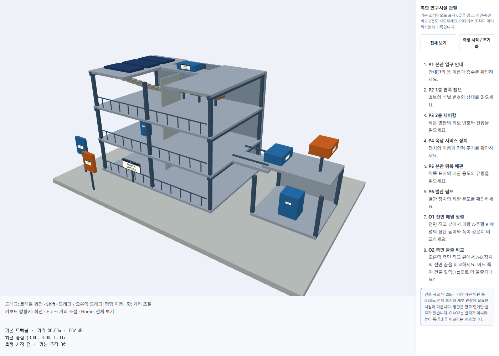
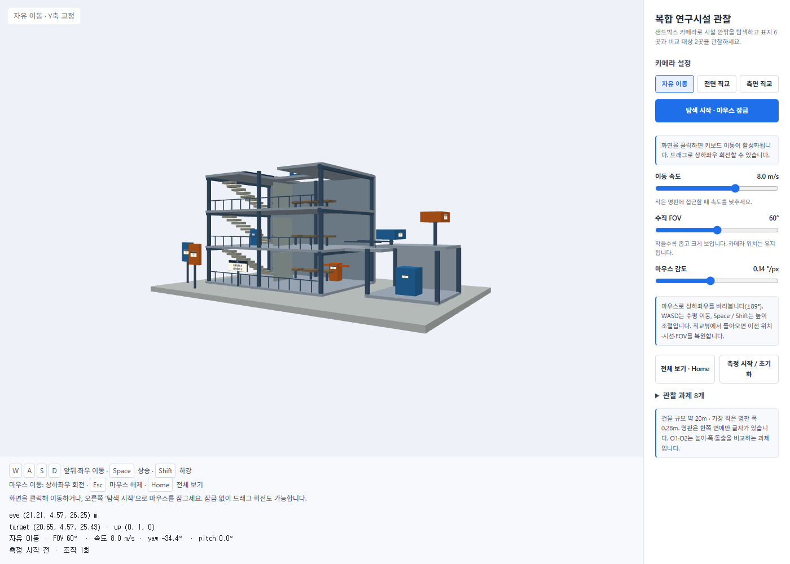
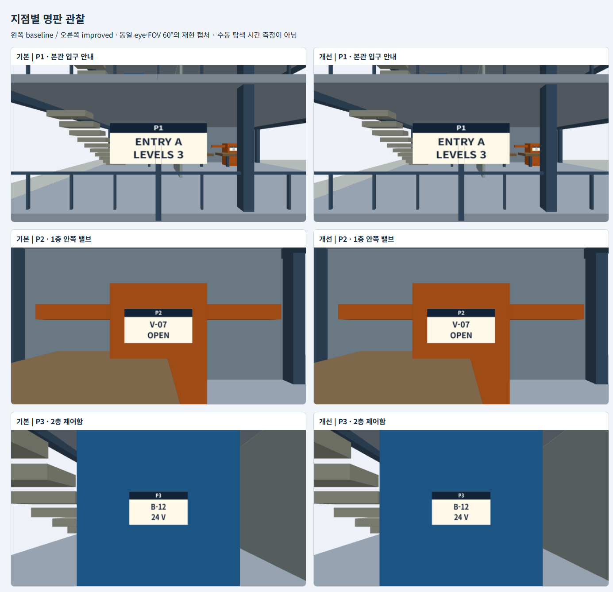
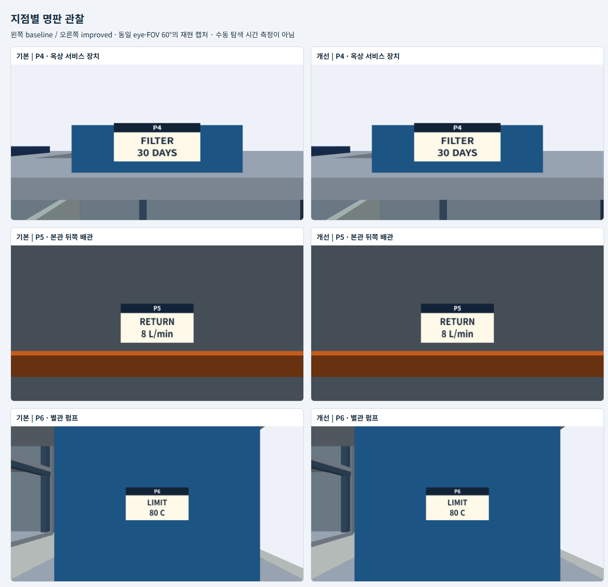
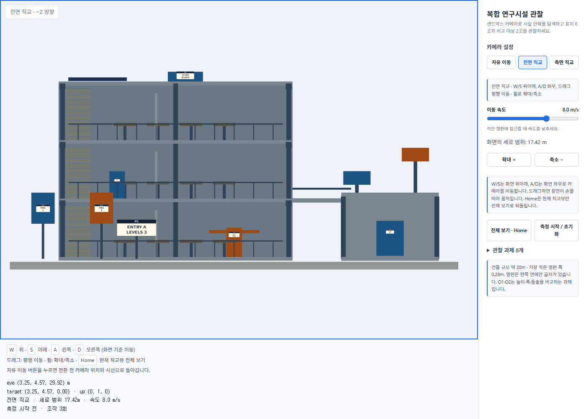
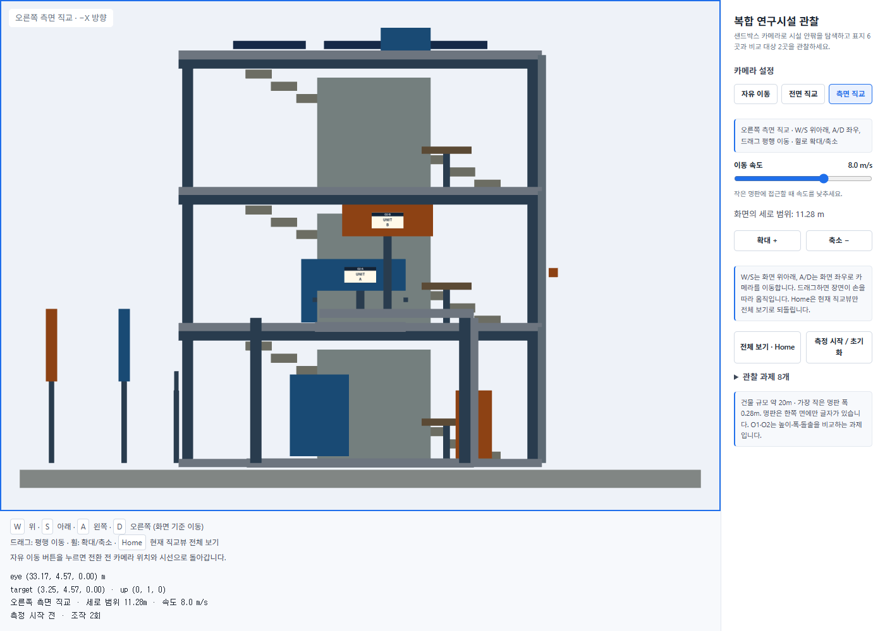
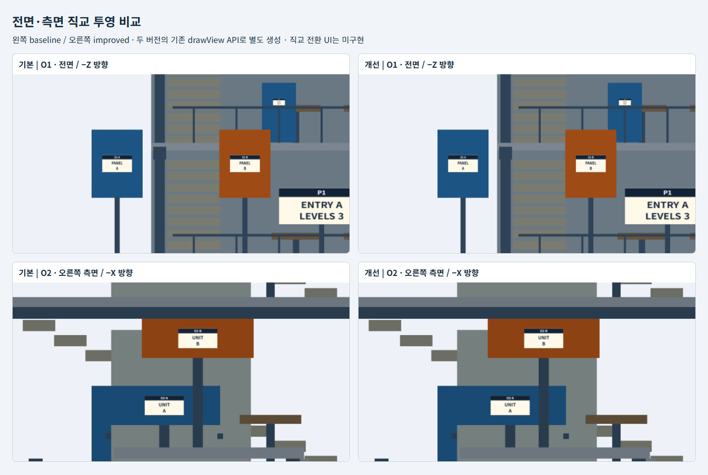
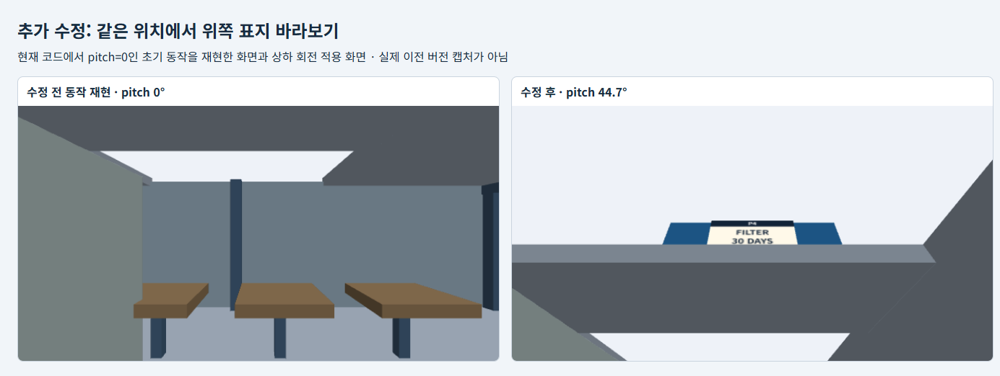

# 4주차 보고서

- 이름: 강진영
- 저장소: https://github.com/tqwuis/cg-solar
- GitHub Pages 실행: [기본 버전](https://tqwuis.github.io/cg-solar/week4/baseline/index.html) · [개선 버전](https://tqwuis.github.io/cg-solar/week4/improved/index.html)

제공된 시작 코드를 `week4/improved`에서 수정하여 샌드박스 방식의 자유 이동 카메라와 전면·측면 직교뷰를 구현했다. `week4/baseline`은 비교용 원본으로 유지했고, 건물과 명판의 위치·크기·내용도 변경하지 않았다.

보고서는 기본 버전에서 느낀 불편, 설계 대안, 구현 내용, 관찰 결과, 추가 수정 순서로 정리했다. 직접 측정한 시간과 재현 캡처를 구분했다.

## 두 버전의 실행과 조작법

### 기본 버전



건물을 중심으로 카메라가 회전하는 트랙볼 방식이다. 회전과 화면 기준 평행 이동, 카메라와 중심 사이의 거리 조절을 조합해 관찰한다.

| 입력 | 동작 |
| --- | --- |
| 마우스 드래그 | 트랙볼 회전 |
| Shift + 드래그 / 오른쪽 버튼 드래그 | 화면 기준 평행 이동 |
| 마우스 휠 | 회전 중심과 카메라 사이의 거리 조절 |
| 방향키 | 회전 |
| + / − | 거리 축소 / 확대 |
| Home / 전체 보기 | 초기 카메라로 복귀 |
| 측정 시작 / 초기화 | 경과 시간과 조작 횟수 초기화 |

키보드 조작은 캔버스에 포커스가 있을 때 사용한다. 기본 FOV는 45°이며 휠은 FOV가 아니라 거리를 바꾼다.

### 개선 버전



현재 개선 버전은 `자유 이동`, `전면 직교`, `측면 직교` 버튼으로 관찰 방식을 전환한다. 자유 이동에서는 카메라가 현재 위치에서 방향을 바꾸고, 키보드로 시설 안팎을 이동한다. `탐색 시작` 버튼으로 마우스를 잠그거나, 화면을 클릭한 뒤 드래그하여 회전할 수 있다.

자유 이동의 조작법은 다음과 같다.

| 입력 | 동작 |
| --- | --- |
| W / S | 바라보는 수평 방향으로 전진 / 후진 |
| A / D | 왼쪽 / 오른쪽으로 수평 이동 |
| Space / Shift | 월드 Y축 기준 상승 / 하강 |
| 마우스 좌우 이동 | 좌우 회전, yaw 변경 |
| 마우스 상하 이동 | 위아래 회전, pitch 변경 |
| Esc | 마우스 잠금 해제 |
| Home / 전체 보기 | 전체 모델을 보는 위치로 복귀, FOV 60°·pitch 0° |
| 속도 / FOV / 감도 슬라이더 | 이동 속도, 수직 화각, 마우스 감도 조절 |
| 측정 시작 / 초기화 | 경과 시간과 조작 횟수 초기화 |

이동 속도는 기본 8 m/s이고 0.2~12 m/s로 조절한다. 위아래를 바라보아도 WASD는 수평 이동을 유지한다. 충돌과 중력은 구현하지 않았으므로 벽과 바닥을 통과할 수 있다.

직교뷰에서는 회전을 고정하고 화면을 평행 이동한다. 전면은 −Z 방향, 오른쪽 측면은 −X 방향을 바라본다.

| 직교뷰 입력 | 동작 |
| --- | --- |
| W / S | 카메라를 화면 위 / 아래로 이동 |
| A / D | 카메라를 화면 왼쪽 / 오른쪽으로 이동 |
| Space / Shift | W / S와 같은 상하 이동 |
| 왼쪽 버튼 드래그 | 장면이 손을 따라 움직이도록 평행 이동 |
| 휠 / 확대·축소 버튼 | 직교 투영의 표시 범위 조절 |
| Home / 전체 보기 | 현재 직교뷰의 중심과 표시 범위 초기화 |
| 자유 이동 버튼 | 직교뷰 전환 전 위치·시선·FOV로 복귀 |

전면과 측면의 이동·확대 상태는 각각 유지한다. 직교뷰에서 Home을 눌러도 저장된 자유 이동 카메라는 바뀌지 않는다. 이 상태는 페이지가 열린 동안 유지되며 새로고침하면 초기화된다.

## 기본 버전의 관찰 결과와 불편

### 지점별 관찰 결과

먼저 **관찰 위치를 지정한 재현 캡처와 모델 데이터**로 각 지점에서 확인할 내용을 정리했다. 직접 조작하여 탐색한 P1~P6의 성공 여부와 시간은 뒤의 실측 표에 별도로 기록했다.

| 지점 | 관찰 목표 | 확인한 결과 | 기본 방식에서 필요한 조작 |
| --- | --- | --- | --- |
| P1 본관 입구 | 동 이름과 층수 | `ENTRY A`, `LEVELS 3` | 전면으로 회전하고 안내판에 접근 |
| P2 1층 안쪽 밸브 | 식별 번호와 상태 | `V-07`, `OPEN` | 실내 표지가 보이는 방향으로 중심 이동 후 거리 조절 |
| P3 2층 제어함 | 회로 번호와 전압 | `B-12`, `24 V` | 2층 높이로 평행 이동하고 작은 명판 확대 |
| P4 옥상 서비스 장치 | 이름과 점검 주기 | `FILTER`, `30 DAYS` | 옥상이 보이도록 회전하고 표지 앞쪽으로 접근 |
| P5 본관 뒤쪽 배관 | 용도와 유량 | `RETURN`, `8 L/min` | 건물 뒤로 돌아가 명판의 글자가 있는 면을 관찰 |
| P6 별관 펌프 | 제한 온도 | `LIMIT`, `80 C` | 별관으로 중심을 옮기고 명판에 접근 |
| O1 전면 패널 | A·B의 폭과 상단 높이 | 둘 다 폭 1.2 m, 상단 y=3.4 m | 정확한 비교에는 전면 직교 투영이 필요 |
| O2 측면 장치 | 어느 장치가 +z로 더 돌출되는가 | A의 전면 z=1.0 m, B는 z=0.4 m. A가 0.6 m 더 돌출 | 정확한 비교에는 오른쪽 측면 직교 투영이 필요 |

O1/O2의 수치는 모델 좌표와 크기에서 계산한 값이다. 화면에서 길이를 직접 측정한 결과는 아니다. 기본 버전에는 직교 투영 전환 버튼이 없지만, 현재 개선 버전에서는 전면·측면 직교 버튼으로 비교할 수 있다.

### 직접 느낀 불편과 코드에서 확인한 원인

| 항목 | 불편했던 점 | 동작 원인과 관찰에 미친 영향 |
| --- | --- | --- |
| 1 | **회전 중 화면의 위쪽이 달라질 수 있다.** | 기본 트랙볼은 eye와 up을 함께 회전시킨다. 층과 기둥이 기울어진 상태에서는 위아래 방향을 다시 파악해야 한다. |
| 2 | **관찰 지점과 회전 중심이 다를 수 있다.** | 초기에 중심은 `[3,3,0]`이다. P5 뒤쪽이나 P6 별관을 관찰하려면 회전뿐 아니라 중심 이동도 필요하다. |
| 3 | **화면 기준 이동과 실제 높이 이동이 다르다.** | Shift 드래그는 카메라의 right/up 방향을 사용한다. 카메라가 기울어지면 화면 위로 이동하는 것이 월드 +Y 상승과 같지 않다. |

이런 불편을 줄이기 위해 카메라의 위쪽 기준을 고정하고, 위치 이동과 시선 회전을 나누는 방향으로 개선안을 정했다.

## 사용자와 관찰 목표, 대안 비교

### 의도 — 무엇을 만들고 싶었는가

사용자는 시설의 외형뿐 아니라 내부·옥상·뒤쪽의 작은 명판을 확인하려는 관찰자로 설정했다. 마우스와 키보드를 함께 사용하고, 공간을 직접 이동하며 세부 구조를 살펴보는 상황을 대상으로 한다.

목표는 P1~P6에서 글자를 읽을 수 있는 위치와 방향을 찾고, O1/O2에서 크기와 돌출 관계를 판단하는 것이다. 제공 모델을 확대하거나 명판을 별도 답 목록으로 대체하지 않고, 카메라와 입력 방식을 바꾸는 데 집중했다.


### 대안 스케치

아래는 보고서에서 비교한 설계 대안이다. 처음에는 B의 자유 이동을 구현했고, 이후 C의 직교 관찰 기능을 버튼 전환 방식으로 조합했다.

**대안 A — up을 고정한 궤도 카메라**

```text
┌──────────────────────┬─────────────┐
│       eye ↘          │ 전체 보기   │
│     ↶ [건물·target]  │ 거리 조절   │
│       중심 주위 회전 │ 중심 이동   │
└──────────────────────┴─────────────┘
드래그: 회전 / Shift 드래그: 평행 이동 / 휠: 거리
```

기존 조작에 익숙한 사용자가 적응하기 쉽고 외형을 둘러보기 좋다. up을 고정하면 기울어짐도 줄일 수 있다. 다만 내부의 작은 명판을 찾아갈 때는 여전히 회전 중심을 옮겨야 한다.

**대안 B — 샌드박스 카메라와 설정 패널**

```text
┌──────────────────────┬─────────────┐
│          W ↑         │ 탐색 시작   │
│       A ← eye → D    │ 이동 속도   │
│          S ↓         │ FOV / 감도  │
│ 마우스: 현재 위치 회전│ 전체 보기   │
└──────────────────────┴─────────────┘
Space / Shift: 높이 조절 / Esc: UI로 돌아오기
```

관찰자가 직접 명판 앞으로 이동하고 현재 위치에서 시선을 바꿀 수 있다. P2·P3처럼 실내에 있는 지점과 P5 뒤쪽을 관찰하는 목적에 맞는다. 키보드 이동에 익숙하지 않은 사용자는 연습이 필요하며, 충돌이 없어 구조물을 통과할 수 있다.

**대안 C — 자유 이동과 전면·측면 직교 뷰의 조합**

```text
┌──────────────────────┬─────────────┐
│                      │ 전면 직교   │
│  원근 투영 자유 탐색  ├─────────────┤
│                      │ 측면 직교   │
└──────────────────────┴─────────────┘
명판 탐색: 원근 뷰 / 폭·돌출 비교: 직교 뷰
```

P1~P6의 탐색과 O1/O2의 정확한 비교를 함께 지원할 수 있다. 스케치처럼 화면을 나누면 작은 명판을 보여 줄 공간이 줄어든다. 실제 구현에서는 하나의 큰 화면에서 버튼으로 뷰를 전환하고, 각 카메라 상태를 보관하는 방식을 사용했다.

### 어떤 대안을 선택·조합했는가

| 대안 | 작은 명판에 접근 | 화면 방향 유지 | O1/O2 정밀 비교 | 현재 반영 여부 |
| --- | --- | --- | --- | --- |
| A 고정 up 궤도 | 중심 이동 필요 | 가능 | 별도 직교 뷰 필요 | 월드 up 고정 원칙 반영 |
| B 샌드박스 | 위치를 직접 이동 | 가능 | 원근 뷰만으로는 한계 | 카메라와 UI 구현 |
| C 자유 이동 + 직교 | 가능 | 가능 | 적합 | 전면·측면 버튼 전환, 평행 이동, 확대·축소 구현 |

실제 구현은 **B의 자유 이동에 월드 up 고정, Home 복귀, 속도·FOV·감도 조절을 적용하고 C의 직교뷰를 조합**했다. 시설 내부까지 이동하여 관찰하기 쉽게 만드는 것이 우선 목표였고, 원근 투영에서 판단하기 어려운 폭·높이·돌출은 직교뷰로 보완했다. 자유 이동 상태를 기억하도록 하여 직교 비교를 마친 뒤 기존 관찰 위치에서 계속 탐색할 수 있게 했다.

## 실제 구현한 카메라·투영·입력 방식

### eye, target, up과 회전 중심은 어떻게 정했는가

자유 이동에서 `eye`는 실제 카메라 위치로 둔다. `target`은 특정 건물 지점이 아니라 현재 시선 방향으로 1 m 앞의 가상 점이다. 회전 중심은 현재 eye이므로 마우스로 회전해도 카메라 위치는 바뀌지 않는다. 직교뷰에서는 별도의 target을 화면 중심으로 사용하며, 고정된 축 방향에서 이 점을 바라본다.

월드 up은 항상 `[0,1,0]`이다. 자유 이동에서는 yaw로 좌우를, pitch로 위아래를 바라본다. pitch가 생기면 화면의 위쪽 방향은 월드 up을 시선에 수직인 평면에 투영한 방향이 되고, 별도의 roll은 적용하지 않는다. 직교뷰에서는 시선 방향을 고정한다.

[카메라 조작 코드](improved/d04-inspection-controls.js)에서 발췌했다.

```javascript
const horizontalForward = () => [Math.sin(state.yaw), 0, -Math.cos(state.yaw)];
const forward = () => [Math.sin(state.yaw) * Math.cos(state.pitch),
  Math.sin(state.pitch), -Math.cos(state.yaw) * Math.cos(state.pitch)];

function camera() {
  if (state.mode !== 'free') {
    const v = views[state.mode], offset = state.mode === 'front' ? [0,0,1] : [1,0,0];
    return {eye:v.target.map((n,i)=>n+offset[i]*(2*radius+1)), target:[...v.target],
      up:[0,1,0], orthographic:true, halfHeight:v.halfHeight, near:.02, far:4*radius+10};
  }
  const f = forward();
  return {eye:[...state.eye], target:state.eye.map((v,i) => v + f[i]), up:[0,1,0],
    fov:state.fov, near:.02,
    far:Math.max(180, Math.hypot(...state.eye.map((v,i) => v - center[i])) + radius + 10)};
}
```

### 자유 이동의 초기 위치와 FOV는 어떻게 정했는가

모델 경계 상자의 중심은 `C=(3.25,4.575,0)`이다. 반지름 R은 경계 상자 대각선 길이의 절반으로 잡았다. 전체 모델을 포함하는 구가 화면에 들어가도록 가로·세로 중 작은 반화각을 사용한다.

```text
R = length(max − min) / 2
세로 반화각 αy = FOV / 2
가로 반화각 αx = atan(tan(αy) × aspect)
d = 1.1 × R / sin(min(αx, αy))
eye = C − forward × d
```

초기 yaw는 −0.6 rad, pitch는 0이다. `1.1`은 전체 보기의 여유 공간을 주기 위한 값이다. 화면 비율이 달라진 뒤 Home을 누르면 거리를 다시 계산한다.

수직 FOV는 기본 60°이며 30~90°로 조절한다. FOV를 줄이면 위치를 유지한 채 좁은 범위를 크게 볼 수 있다. near는 0.02 m이고 far는 최소 180 m로 두되, 멀리 이동하면 모델까지의 거리에 맞춰 늘린다.

### 원근 투영과 직교 투영은 어떻게 사용했는가

자유 이동 화면은 **원근 투영**이다. 가까운 물체가 크게 보여 이동과 공간의 깊이를 파악하기 쉽다. 기존 렌더러의 `M4.lookAt`과 `M4.perspective`를 그대로 사용했다.

전면·측면 화면은 **직교 투영**이다. 제공 렌더러에 있던 `drawView`의 `orthographic:true`와 `halfHeight`를 재사용하고, 전환 버튼과 직교 카메라의 상태 관리·입력 처리를 추가했다. FOV 대신 화면 세로 범위의 절반인 `halfHeight`로 확대 정도를 정한다. 값이 작을수록 좁은 범위가 크게 보인다.

직교뷰의 첫 진입과 Home에서는 target을 모델 중심으로 정한다. `halfHeight`는 모델 높이의 절반과 화면 비율을 고려한 가로 범위 중 큰 값에 1.1을 곱한다. 전면은 X축 범위, 측면은 Z축 범위를 가로 크기로 사용한다.

[렌더러 코드](improved/d04-inspection-viewer.js)의 핵심 부분이다.

```javascript
M.lookAt(view,camera.eye,camera.target,camera.up||[0,1,0]);
if(camera.orthographic){
  const half=camera.halfHeight||8;
  M.ortho(projection,-half*w/h,half*w/h,-half,half,camera.near||.02,camera.far||180);
}else{
  M.perspective(projection,(camera.fov||controls.state.fov)*Math.PI/180,
    w/h,camera.near||.02,camera.far||180);
}
M.multiply(vp,projection,view);
```

### 뷰를 전환할 때 자유 이동 상태는 어떻게 기억하는가

`state.eye`, `state.yaw`, `state.pitch`, `state.fov`는 자유 이동 전용으로 유지한다. 직교뷰의 중심과 표시 범위는 `views.front`, `views.side`에 따로 저장한다. 직교뷰에서 이동하거나 확대해도 자유 이동 값을 덮어쓰지 않으므로 `free`로 돌아오면 이전 위치·시선·FOV가 복원된다.

```javascript
const views = {front:null, side:null};

function setMode(mode) {
  if (!['free','front','side'].includes(mode) || mode === state.mode) return;
  clearInput();
  state.mode = mode;
  if (mode !== 'free' && !views[mode]) resetView();
  if (locked()) document.exitPointerLock();
  state.actions++;
  canvas.focus({preventScroll:true});
  viewChanged();
  notify(instructions());
}
```

직교뷰에 처음 들어갈 때만 전체 보기 상태를 만든다. 이후 전면과 측면을 오가면 각 뷰의 이동·확대 상태가 유지된다. Home도 현재 모드만 초기화하도록 처리했다.

### 입력은 어떻게 처리했는가

키를 누르면 Set에 등록하고, 매 프레임 `speed × dt`만큼 이동한다. 입력을 정규화하여 대각선 이동이 더 빨라지는 것을 막았다. 자유 이동에서는 상승·하강에 월드 Y축을 사용하고, WASD는 pitch에 관계없이 수평 방향을 사용한다.

```javascript
const step = state.speed * Math.min(Math.max(dt, 0), .05) / length;
const f = horizontalForward(), right = [Math.cos(state.yaw), 0, Math.sin(state.yaw)];
state.eye = state.eye.map((v,i) => v + step *
  (longitudinal * f[i] + lateral * right[i] + (i === 1 ? vertical : 0)));
```

이 부분은 입력 벡터의 길이 `length`가 0이 아닐 때 실행한다. 긴 프레임에서 큰 폭으로 이동하지 않도록 dt를 0.05초로 제한했다.

자유 이동의 마우스 잠금 상태에서는 `movementX/Y`, 드래그 상태에서는 이전 포인터 좌표와 현재 좌표의 차이를 회전에 사용한다. 창 전환·포커스 상실·잠금 해제·뷰 전환 시 입력 상태를 비워 키를 놓았는데 계속 움직이는 상황을 방지했다.

```javascript
function turn(dx, dy) {
  state.yaw += dx * state.sensitivity;
  state.yaw = Math.atan2(Math.sin(state.yaw), Math.cos(state.yaw));
  state.pitch = Math.max(-pitchLimit,
    Math.min(pitchLimit, state.pitch - dy * state.sensitivity));
}
```

`pitchLimit`은 89°이다. 위로 움직이는 마우스의 dy는 음수이므로 이를 빼면 위를 바라보게 된다. 시선이 up과 평행해지는 ±90°를 피하고 화면이 뒤집히지 않도록 제한했다.

직교뷰에서는 W/S가 화면 위아래, A/D가 좌우 이동으로 바뀐다. 전면의 오른쪽 벡터는 `[1,0,0]`, 측면은 `[0,0,-1]`이다. 드래그도 회전 대신 평행 이동으로 처리한다.

```javascript
function pan(dx, dy) {
  const v = views[state.mode], right = viewRight();
  const unit = 2*v.halfHeight / Math.max(1,canvas.getBoundingClientRect().height);
  v.target = v.target.map((n,i)=>n-dx*unit*right[i]+(i===1?dy*unit:0));
}
```

`unit`은 화면의 CSS 픽셀 하나에 해당하는 실제 길이이다. 표시 범위에 맞춰 이동량을 계산하므로 확대 상태에서도 장면이 드래그를 따라 움직인다. 직교뷰에서는 마우스 잠금을 해제하고, FOV·감도 대신 확대·축소 UI를 표시한다.

## 같은 8건의 개선 전후 비교

### 비교 조건과 캡처 방법

명판·직교 비교 이미지는 직교 전환 UI를 추가하기 전에 기본 버전과 당시 개선 버전을 같은 로컬 서버에서 Headless Chrome으로 실행하여 만들었다. 각 버전의 `drawView`에 동일한 eye·target·up·투영 설정을 전달하고, 640×340 렌더링 결과를 비교 화면에 배치했다. 물체를 숨기거나 명판 크기를 바꾸지 않았다. 이후 직교뷰 UI를 추가했지만 모델과 렌더러의 투영 방식은 그대로이므로 비교 이미지는 유지했다.

명판 비교의 FOV는 두 버전 모두 60°로 통일했다. 기본 버전의 초기 FOV 45°와는 다른 **비교용 설정**이다. 카메라 위치를 자동 지정했으므로 이 캡처가 수동 조작의 편의성이나 시간 단축을 증명하는 것은 아니다. 앞의 개선 버전 전체 화면과 아래의 현재 직교뷰 화면은 UI 추가 후 새로 캡처한 것이다.

캡처 설정은 [capture-settings.json](images/capture-settings.json)에 기록했다.

### P1~P6 명판 관찰





왼쪽이 기본 버전이고 오른쪽이 개선 버전이다. 지정된 시점에서는 두 버전 모두 같은 명판 내용을 읽을 수 있다. 개선의 대상은 모델이나 문자 자체보다 **그 시점까지 이동하고 방향을 맞추는 과정**이다.

| 지점 | 기본 버전의 접근 방식 | 개선 버전의 접근 방식 | 캡처로 확인한 결과 / 남은 한계 |
| --- | --- | --- | --- |
| P1 | 안내판 중심으로 평행 이동 후 거리 조절 | 전면으로 이동하고 yaw/pitch 조절 | 두 버전 모두 동 이름·층수 판독 가능 |
| P2 | 실내가 보이는 방향으로 회전·평행 이동 | WASD로 실내 접근, 낮은 속도로 미세 조절 | 두 버전 모두 번호·상태 판독 가능. 가림은 위치를 바꿔 해결해야 함 |
| P3 | 2층 높이로 중심 이동 후 확대 | Space로 높이 조절, 속도를 낮추고 접근 | 두 버전 모두 회로·전압 판독 가능. 작은 명판이라 근접 필요 |
| P4 | 옥상이 보이도록 회전·중심 이동 | 상승하고 마우스로 위아래 시선 조절 | 두 버전 모두 이름·주기 판독 가능. 옥상 구조물의 가림은 남음 |
| P5 | 건물 뒤쪽으로 회전 후 표지에 접근 | 뒤쪽으로 이동한 뒤 반대 방향을 바라봄 | 두 버전 모두 용도·유량 판독 가능. 글자는 한쪽 면에만 있음 |
| P6 | 별관 쪽으로 중심을 옮긴 뒤 확대 | 별관으로 직접 이동하여 접근 | 두 버전 모두 제한 온도 판독 가능 |
| O1 | 원근 화면에서 전면 정렬. 직교 관찰은 개발자 API 사용 | 전면 직교 버튼으로 전환한 뒤 이동·확대 | 폭·상단 높이가 같음을 직교 캡처에서 확인. 새 UI의 관찰 시간은 미측정 |
| O2 | 원근 화면에서 측면 정렬. 직교 관찰은 개발자 API 사용 | 측면 직교 버튼으로 전환한 뒤 이동·확대 | A가 +z로 더 돌출됨을 직교 캡처에서 확인. 새 UI의 관찰 시간은 미측정 |

### 전면·측면 직교 캡처

현재 개선 버전의 전면·측면 버튼으로 전환하고 Home을 누른 화면이다. 전면은 시설 양끝까지 보이도록 축소 버튼을 한 번 더 눌렀다. 대상을 자세히 비교하려면 WASD 또는 드래그로 중심을 옮기고 휠로 확대한다.





아래는 앞서 API로 시점을 지정하여 만든 지점별 비교 이미지이다. 이미지 안의 ‘직교 전환 UI는 미구현’이라는 문구는 **캡처 당시의 상태**를 뜻하며, 현재 개선 버전에는 전환 UI가 추가되어 있다.



윗줄은 O1의 전면 직교 화면이다. 파랑 A와 주황 B의 상단이 같은 높이에 있고 폭도 같다. 두 패널은 z 위치가 다르지만, 직교 투영에서는 깊이 때문에 크기가 달라지지 않는다.

아랫줄은 O2의 오른쪽 측면 직교 화면이다. 이 시점에서는 화면 왼쪽이 건물 앞쪽인 +z 방향이다. 파랑 A의 전면 끝이 주황 B보다 더 왼쪽에 있다.

```text
O1: A·B 폭 = 1.2 m, 상단 y = 2.6 + 1.6/2 = 3.4 m
O2: A 전면 z = 0 + 2/2 = 1.0 m
    B 전면 z = −0.6 + 2/2 = 0.4 m
    A가 +z 방향으로 0.6 m 더 돌출
```

현재 개선 버전은 버튼으로 직교뷰를 사용할 수 있다. 아래 코드는 기존 비교 이미지의 시점을 각 버전에서 정확히 재현할 때 사용하는 방법이다. `viewer.render`를 지정한 동안은 고정된 캡처용 카메라를 사용하므로, UI 조작으로 돌아오려면 `viewer.render = null`로 해제해야 한다. 투영 비율은 현재 캔버스 비율을 따른다.

```javascript
const viewer = window.InspectionViewer;
const front = {
  eye: [-5.3, 2.6, 16], target: [-5.3, 2.6, 6], up: [0, 1, 0],
  orthographic: true, halfHeight: 2.1
};
const side = {
  eye: [23, 4.75, -0.3], target: [10.8, 4.75, -0.3], up: [0, 1, 0],
  orthographic: true, halfHeight: 1.6
};
viewer.render = () => viewer.drawView(front); // O1 전면
// viewer.render = () => viewer.drawView(side); // O2 측면
// viewer.render = null; // 기본 탐색 화면으로 복귀
```

### 직접 측정한 개선 전후 기록

측정은 개인 노트북에서 진행했다. 각 버전에서 전체 보기를 누른 뒤 측정을 시작하고, **P1부터 P6까지 순서대로 연속 관찰**했다. 지점마다 타이머를 초기화하지 않고, 각 명판을 읽었을 때 표시된 누적 시간을 기록했다.

개선 버전의 설정은 이동 속도 8 m/s, FOV 60°, 마우스 감도 약 0.14°/px였다. 기본 버전은 전체 보기의 기본 FOV가 45°이므로, 이 기록을 두 버전의 화각까지 동일하게 통제한 실험으로 해석하지는 않는다. O1/O2는 직교뷰 측정 방법의 문제로 따로 측정하지 않았다.

| 지점 | 기본 성공 여부 | 기본 누적 시간(초) | 개선 성공 여부 | 개선 누적 시간(초) | 직접 느낀 차이 |
| --- | --- | --- | --- | --- | --- |
| P1 | O | 12 | O | 6 | 기본 버전에서는 처음부터 모델이 비스듬하게 보여 시점을 맞추는 데 시간이 더 걸렸다. |
| P2 | O | 24 | O | 10 | 오른쪽 앞으로 접근하는 경로는 단순했지만, 조작 방식의 난이도에서 차이를 느꼈다. |
| P3 | O | 46 | O | 15 | 확대된 화면에서 다시 주변을 보고 다음 목적지를 찾는 과정이 기본 버전에서 특히 불편했다. 가장 큰 개선을 느낀 구간이었다. |
| P4 | O | 61 | O | 17 | 화면의 확대 정도를 조절하고 위로 평행 이동하던 과정을, 개선 버전에서는 카메라를 위로 이동하는 조작으로 줄일 수 있었다. |
| P5 | O | 70 | O | 25 | 두 버전 모두 뒤쪽을 보기 위해 시점을 크게 바꿔야 했다. 이 구간 자체의 소요 시간은 거의 차이가 없었다. |
| P6 | O | 88 | O | 34 | 기본 버전에서는 회전한 뒤 별관 쪽으로 확대하는 과정이 어려웠다. |

누적 시간의 차이를 지점별 관찰 시간으로 오해하지 않도록, 이전 지점의 기록을 빼서 구간별 소요 시간도 계산했다. 이 값에는 다음 지점까지 이동하고 명판을 읽는 과정이 함께 포함된다.

| 관찰 구간 | 기본 소요 시간(초) | 개선 소요 시간(초) |
| --- | --- | --- |
| 시작 → P1 | 12 | 6 |
| P1 → P2 | 12 | 4 |
| P2 → P3 | 22 | 5 |
| P3 → P4 | 15 | 2 |
| P4 → P5 | 9 | 8 |
| P5 → P6 | 18 | 9 |
| 전체 P1~P6 | 88 | 34 |

이번 기록에서 전체 관찰 시간은 88초에서 34초로 54초 줄었다. 구간별 차이는 P2→P3에서 17초로 가장 컸고, P4→P5에서는 1초였다. 이는 P3에서 가장 큰 개선을 느꼈고 P5에서는 차이가 적었다는 경험과 맞는다. 다만 한 사용자의 이번 관찰 기록이며 반복 측정에 따른 평균은 아니다.

### 측정의 한계

기본 버전의 `actions`는 드래그 시작·휠 이벤트·키 이벤트 등을 센다. 개선 버전은 이동 키가 새로 눌린 경우와 드래그 시작 등을 세지만, 잠금 상태의 마우스 이동과 슬라이더 변경은 횟수에 포함하지 않는다. 같은 1회가 뜻하는 조작량이 달라 **표시된 횟수만으로 어느 버전이 더 효율적인지 단정할 수 없다.**

P1~P6의 직접 탐색 시간은 위 표에 기록했지만, 자동 시점 지정 캡처 자체는 렌더링 확인용이다. 캡처로 탐색 시간이나 오조작·피로도를 판단할 수는 없다. O1/O2는 직교 전환 UI를 추가한 뒤의 관찰 시간을 아직 측정하지 않았으므로, 기능 구현과 관찰 효율 검증을 구분해야 한다.

P1~P6을 연속으로 관찰했으므로 뒤쪽 지점의 누적 시간에는 앞선 지점에서 사용한 시간도 포함된다. 구간별 시간 역시 독립적인 시작 위치에서 측정한 값이 아니므로, 지점 자체의 난이도만을 나타내지는 않는다. 버전별 실행 순서와 연습 횟수는 따로 기록하지 않아 학습 효과를 분리하기 어렵다. 키보드 조작 경험, 화면 크기와 FOV도 결과에 영향을 줄 수 있다.

개선 버전은 20 FPS 미만에서 dt 제한 때문에 설정한 속도보다 느리게 이동할 수 있다. 충돌이 없어 실제로 갈 수 없는 위치에서도 관찰할 수 있다는 점도 고려해야 한다.

직접 사용하면서 느낀 한계도 있다. 기본 버전은 회전과 거리 조절로 시점을 크게 바꿀 수 있지만, 개선 버전의 자유 이동은 카메라가 목적지까지 이동해야 한다. 가까운 지점을 연속해서 관찰하기는 쉬워졌지만, 멀리 떨어진 지점으로 이동하는 데에는 부담이 남았다. 직교뷰 전환은 비교 관찰을 보완하지만 자유 이동의 장거리 이동 문제까지 해결하지는 않는다.

## 추가 수정 전후의 기록

### 1차 수정 — 마우스 상하 회전 추가

처음에는 마우스 가로 이동으로 yaw만 바꾸고 시선을 수평으로 유지했다. 높이가 다른 표지는 Space/Shift로 카메라 높이를 옮겨 바라보는 방식이었다. 직접 사용했을 때 제자리에서 위아래를 바라볼 수 없어 자유로운 관찰이 어렵다고 느꼈다.

이후 **“마우스를 위아래로 움직였을 때 카메라가 위아래로 회전하는 것을 추가”**하도록 요청하여 pitch를 추가했다. 잠금 상태와 드래그 상태 모두 세로 이동을 처리하고, pitch를 ±89°로 제한했다. WASD 수평 이동과 월드 up 고정은 유지했다.



두 화면의 eye는 `[0.5,7.8,1.2]`로 같다. 왼쪽은 당시 렌더러에서 pitch 0°로 이전 동작을 재현한 것이고, 오른쪽은 약 44.7° 위를 바라본다. 왼쪽에서는 P4가 시선 중심에 없지만 오른쪽에서는 위쪽 표지가 보인다. 아래에서 비스듬히 바라보므로 지붕 가장자리의 가림과 글자의 축소는 남아 있다.

| 항목 | 처음 구현 | 추가 수정 후 |
| --- | --- | --- |
| 마우스 세로 입력 | 무시 | pitch 변경 |
| 시선 방향 | 항상 수평 | 위아래 ±89° |
| 회전 중심 | eye | eye 유지 |
| up과 roll | 월드 +Y, roll 없음 | 동일 |
| WASD | 수평 이동 | pitch와 무관한 수평 이동 |
| Home | 위치·yaw·FOV 복귀 | pitch 0° 복귀도 포함 |

추가 수정 후 Headless Chrome에서 상하 입력 방향, 양쪽 각도 제한과 렌더링, yaw/pitch 동시 회전, 수평 이동 유지, Home 초기화, 드래그 처리 등 7개 검증 항목을 통과했다. 이는 기능 검증이며 사용자 관찰 시간 측정과는 다르다. 자세한 내용은 [CAMERA.md](improved/CAMERA.md)에 정리했다.

### 2차 수정 — 직교뷰 전환과 자유 이동 상태 복원

상하 회전 추가로 시선을 자유롭게 바꿀 수 있게 되었지만, 원근 화면만으로는 O1/O2의 폭·높이·돌출을 비교하는 데 한계가 남았다. 당시에는 직교뷰를 UI에서 선택할 수 없어 보고서 캡처를 별도 API로 만들었다. 이 문제를 해결하기 위해 전면·측면 직교뷰 전환 버튼을 요청했다.

직교뷰에서도 WASD와 드래그로 관찰 위치를 옮길 수 있게 하고, 자유 이동으로 돌아올 때 이전 카메라 상태를 기억하도록 했다. 휠·버튼 확대와 각 뷰의 상태 유지도 함께 적용했다.

| 항목 | 직교뷰 UI 추가 전 | 현재 버전 |
| --- | --- | --- |
| 전면·측면 직교 관찰 | 개발자 API로 별도 시점 지정 | 버튼으로 전환 |
| WASD | 자유 이동의 수평 이동 | 직교뷰에서는 화면 상하좌우 평행 이동 |
| 드래그 | 자유 이동의 시선 회전 | 직교뷰에서는 평행 이동 |
| 확대·축소 | 자유 이동의 접근 또는 FOV 조절 | 직교뷰에서는 halfHeight 조절 |
| 자유 이동 복귀 | 뷰 전환 기능 없음 | 이전 eye·yaw·pitch·FOV 유지 |
| Home | 자유 이동 초기화 | 현재 뷰만 초기화 |

직교뷰 추가 후 버튼 전환, 자유 이동 상태 복원, 뷰별 상태 유지, 평행 이동, 확대·축소, 렌더링 등 14개 브라우저 검증을 통과했다. 드래그는 합성 이벤트로, 잠금 해제는 상태를 모사해 확인했다. O1/O2의 사용자 관찰 시간은 아직 다시 측정하지 않았다.

## AI 제안과 본인의 판단

이번 구현 대화에서 사용한 도구는 **Codex**이다.

### 구현 과정에서 확인되는 제안과 결정

| 제안 또는 요청 | 실제 반영 내용 | 검토할 대안·이유 |
| --- | --- | --- |
| 사용자: 모델을 유지하고 샌드박스 카메라 구현 | WASD, Space/Shift, 현재 eye 중심 회전 | 기존 궤도 카메라의 중심 이동을 개선하는 방식도 가능 |
| Codex: 월드 up을 고정하고 좌우 회전부터 구현 | 초기 버전에서 yaw만 적용 | 수평 시선은 단순하지만 높은 곳을 제자리에서 바라볼 수 없음 |
| Codex: 마우스 잠금과 드래그 대체 조작 | 두 입력 방식과 Esc 해제 구현 | 드래그만 사용하면 잠금 없이 조작할 수 있지만 화면 가장자리 제약이 있음 |
| 사용자: 마우스 상하 회전 추가 | pitch와 ±89° 제한, Home 초기화 반영 | 자유로운 360° 회전보다 뒤집힘 방지와 방향 유지에 초점 |
| Codex: 대각선 속도 보정과 포커스 상실 시 입력 해제 | 입력 벡터 정규화와 키 상태 초기화 | 단순 키별 이동 합산은 대각선 속도가 더 빨라질 수 있음 |
| 사용자: 전면·측면 직교뷰, WASD·드래그 이동, 자유 이동 위치 기억 | 버튼 전환과 모드별 입력, 카메라 상태 분리 | 비교 후에도 기존 관찰 위치에서 자유 이동을 이어가기 위해 반영 |

실측에서는 명판에 접근하고 다음 지점으로 이동하는 과정의 차이를 확인했다. 구현 과정에서는 상하 시선 조절과 직교 비교를 차례로 보완했다. 현재 버전은 두 관찰 방식을 함께 지원하지만, 장거리 이동의 부담과 직교뷰의 관찰 효율은 추가 검토가 필요하다.

### 본인이 작성할 제안·검토 기록

| 중요한 Copilot/AI 제안 또는 직접 검토한 대안 | 본인의 판단 | 채택·수정·거절 이유 | 확인한 결과 |
| --- | --- | --- | --- |
| ________ | ________ | ________ | ________ |
| ________ | ________ | ________ | ________ |
| ________ | ________ | ________ | ________ |

AI가 작성한 코드에서 직접 확인한 부분: ________

본인이 직접 수정하거나 최종 결정한 부분: ________

다음에 추가로 수정할 내용: ________
